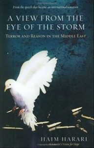

---
# http://learn.getgrav.org/content/headers
title: '"A View From the Eye of the Storm" by Haim Harari'
slug: a-view-from-the-eye-of-the-storm-by-haim-harari
# menu: "A View From the Eye of the Storm" by Haim Harari
date: 04-04-2011
published: true
publish_date: 04-04-2011
# unpublish_date: 04-04-2011
# template: false
# theme: false
visible: true
summary:
    enabled: true
    format: short
    size: 128
taxonomy:
    category: ["Books>Nonfiction"]
    tag: [5star,Haim Harari,politics,religion]
author: aaron
metadata:
    author: aaron
#      description: Your page description goes here
#      keywords: HTML, CSS, XML, JavaScript
#      robots: noindex, nofollow
#      og:
#          title: The Rock
#          type: video.movie
#          url: http://www.imdb.com/title/tt0117500/
#          image: http://ia.media-imdb.com/images/rock.jpg
#  cache_enable: false
#  last_modified: true

---

**Rating:** 5/5

Haim Harari, *A View From the Eye of the Storm: Terror and Reason in the Middle East* (New York: Regan Books, 2005).

Read this book. It will only take a few hours. It is worth every minute.

