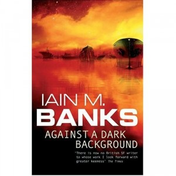

---
# http://learn.getgrav.org/content/headers
title: '"Against a Dark Background" by Iain M. Banks'
slug: against-a-dark-background-by-iain-m-banks
# menu: "Against a Dark Background" by Iain M. Banks
date: 11-05-2012
published: true
publish_date: 11-05-2012
# unpublish_date: 11-05-2012
# template: false
# theme: false
visible: true
summary:
    enabled: true
    format: short
    size: 128
taxonomy:
    category: ["Books>Fiction"]
    tag: [3star,Iain M. Banks,scifi]
author: aaron
metadata:
    author: aaron
#      description: Your page description goes here
#      keywords: HTML, CSS, XML, JavaScript
#      robots: noindex, nofollow
#      og:
#          title: The Rock
#          type: video.movie
#          url: http://www.imdb.com/title/tt0117500/
#          image: http://ia.media-imdb.com/images/rock.jpg
#  cache_enable: false
#  last_modified: true

---

**Rating:** 3/5

Iain M. Banks, *Against a Dark Background* (London: Orbit, 1995).

Well I’m afraid this is it for me and Iain M. Banks. It’s so frustrating! The first two thirds were the best I’ve read of him yet. I loved the characters, the humour was effective, and the action was awesome. He uses flashbacks very effectively to reveal at just the right moment a character’s motivation. The last third, though, just kind of “[jumps the shark](http://tvtropes.org/pmwiki/pmwiki.php/Main/JumpingTheShark),” if you will. New characters with inexplicably altruistic motives appear out of nowhere, old characters equally inexplicably go rogue, and the ending answers nothing!

What finally did it for me was the full-blown porn scene thrown gratuitously in the middle of the book. Yes, sexuality is an integral part of who we are, and yes, I’m OK with a certain degree of “mature subject matter,” but really…really? I don’t need things spelled out in quite that level of detail. If you don’t like porn with your speculative fiction, just skip Banks altogether and go read some [Alastair Reynolds](http://perlkonig.com/tag/alastair-reynolds/). You have been warned.

