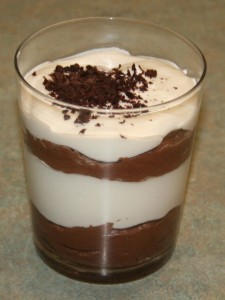
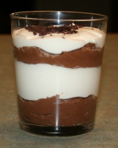

---
# http://learn.getgrav.org/content/headers
title: 'AiB: Chocolate Mousse Redux'
slug: aib-chocolate-mousse-redux
# menu: AiB: Chocolate Mousse Redux
date: 28-09-2011
published: true
publish_date: 28-09-2011
# unpublish_date: 28-09-2011
# template: false
# theme: false
visible: true
summary:
    enabled: true
    format: short
    size: 128
taxonomy:
    category: [Food]
    tag: [Adventures in Baking]
author: aaron
metadata:
    author: aaron
#      description: Your page description goes here
#      keywords: HTML, CSS, XML, JavaScript
#      robots: noindex, nofollow
#      og:
#          title: The Rock
#          type: video.movie
#          url: http://www.imdb.com/title/tt0117500/
#          image: http://ia.media-imdb.com/images/rock.jpg
#  cache_enable: false
#  last_modified: true

---

[Part of the Adventures in Baking (AiB) series.](../adventures-in-baking-aib-overview "Adventures in Baking (AiB): Overview")

[This is the second time I have made the chocolate mousse.](../aib-chocolate-mousse/ "AiB: Chocolate Mousse") This time I did it as a layered parfait, and I used bittersweet chocolate. The bittersweet chocolate makes all the difference. Semi-sweet chocolate is just that little bit too sweet. Num!

