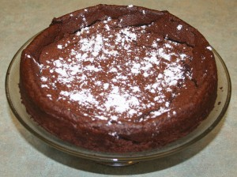

---
# http://learn.getgrav.org/content/headers
title: 'AiB: Craggy Flourless Chocolate Cake'
slug: aib-craggy-flourless-chocolate-cake
# menu: AiB: Craggy Flourless Chocolate Cake
date: 20-10-2011
published: true
publish_date: 20-10-2011
# unpublish_date: 20-10-2011
# template: false
# theme: false
visible: true
summary:
    enabled: true
    format: short
    size: 128
taxonomy:
    category: [Food]
    tag: [Adventures in Baking]
author: aaron
metadata:
    author: aaron
#      description: Your page description goes here
#      keywords: HTML, CSS, XML, JavaScript
#      robots: noindex, nofollow
#      og:
#          title: The Rock
#          type: video.movie
#          url: http://www.imdb.com/title/tt0117500/
#          image: http://ia.media-imdb.com/images/rock.jpg
#  cache_enable: false
#  last_modified: true

---

[Part of the Adventures in Baking (AiB) series.](../adventures-in-baking-aib-overview "Adventures in Baking (AiB): Overview")

Original recipe: <http://www.foodnetwork.ca/recipes/craggy-chocolate-cake/recipe.html?dishid=10332>

I kinda liked it! It’s a different texture, but a really nice flavour. It’s crisp on the outside but light—almost like a souflé—on the inside. I think the texture would be even better if I had the 8&Prime; pan. You’ll notice in the picture that the outside is quite a bit higher than the middle. This is because I only had a 9.5&Prime; pan. If you’re gluten intolerant, this is an excellent recipe. Dust the pan with cocoa powder instead of flour.

Actual yield: N/A

Verdict: Keeper, for the right occasion.

Craggy Flourless Cake
