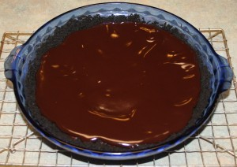
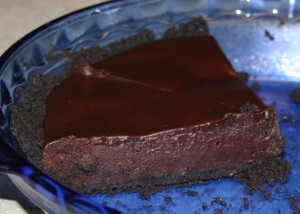

---
# http://learn.getgrav.org/content/headers
title: 'AiB: Oreo Chocolate Truffle Tart with Chocolate Glaze'
slug: aib-oreo-chocolate-truffle-tart-with-chocolate-glaze
# menu: AiB: Oreo Chocolate Truffle Tart with Chocolate Glaze
date: 19-10-2011
published: true
publish_date: 19-10-2011
# unpublish_date: 19-10-2011
# template: false
# theme: false
visible: true
summary:
    enabled: true
    format: short
    size: 128
taxonomy:
    category: [Food]
    tag: [Adventures in Baking]
author: aaron
metadata:
    author: aaron
#      description: Your page description goes here
#      keywords: HTML, CSS, XML, JavaScript
#      robots: noindex, nofollow
#      og:
#          title: The Rock
#          type: video.movie
#          url: http://www.imdb.com/title/tt0117500/
#          image: http://ia.media-imdb.com/images/rock.jpg
#  cache_enable: false
#  last_modified: true

---

[Part of the Adventures in Baking (AiB) series.](../adventures-in-baking-aib-overview "Adventures in Baking (AiB): Overview")

Original recipe: <http://gracessweetlife.com/2011/04/oreo-chocolate-truffle-tart-with-chocolate-glaze/>

This was delicious! I used a 9&Prime; pie pan because I didn’t have an 8&Prime; tart tin. It’s much faster to make than the [Chocolate Mousse Cake](../aib-chocolate-mousse-cake "AiB: Chocolate Mousse Cake") but still satisfies much of the chocolate craving. It gives a nice smooth texture and rich flavour. It beats plain chocolate cream pie any day.

Actual yield: N/A

Verdict: Keeper!

Glaze from above

Slice from the side

