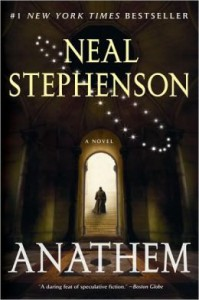

---
# http://learn.getgrav.org/content/headers
title: '"Anathem" by Neal Stephenson'
slug: anathem-by-neal-stephenson
# menu: "Anathem" by Neal Stephenson
date: 17-02-2015
published: true
publish_date: 17-02-2015
# unpublish_date: 17-02-2015
# template: false
# theme: false
visible: true
summary:
    enabled: true
    format: short
    size: 128
taxonomy:
    category: ["Books>Fiction"]
    tag: [4star,Neal Stephenson,scifi]
author: aaron
metadata:
    author: aaron
#      description: Your page description goes here
#      keywords: HTML, CSS, XML, JavaScript
#      robots: noindex, nofollow
#      og:
#          title: The Rock
#          type: video.movie
#          url: http://www.imdb.com/title/tt0117500/
#          image: http://ia.media-imdb.com/images/rock.jpg
#  cache_enable: false
#  last_modified: true

---

**Rating:** 4/5

Neal Stephenson, *Anathem* (New York, NY: William Morrow, 2008).

This is a book that’s all about the journey. It’s quite long (almost a thousand pages), and I’d certainly classify it as a “slow burn.” The story is set in a post-apocalyptic world (but not your run-of-the-mill post-apocalypse) in which theorists are forbidden from contact with actual technology and isolated from the rest of the world in what they call “maths.” The protagonist is a member of one of these maths and the story follows him throughout.

The world Stephenson creates in incredibly detailed and coherent. His characters are well realized, and I really cared about their stories. You have to push through the first couple chapters as you try to get a grasp on the new vocabulary (mostly slightly reworked English, Latin, and French words), but it’s not unmanageable. Stephenson also introduces each section with the definition of a term central to that section, and a glossary is also included.

The story itself alternates between actual action and lengthy (but, in my opinion, interesting) exposition on issues of philosophy and physics. The discussions all map to real-world problems and people, but the names are changed. If you have no interest in such things as the nature of consciousness and parallel universes, this book may not be for you. You have to get through a *lot* of these discussions to get through the story.

While I personally didn’t mind the ending, it is certainly not the kind of payoff you’d expect for such a long book, and you have to sit and stew on it a bit before it all comes together. I really enjoyed the journey, though, and so it’s a strong 4 stars for me. I always wanted to pick the book up again and keep going. If you’re up for a more cerebral story, you can’t go wrong with Stephenson’s *Anathem*.

