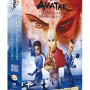
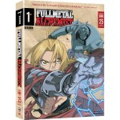

---
# http://learn.getgrav.org/content/headers
title: 'Anime: A Primer'
slug: anime-a-primer
# menu: Anime: A Primer
date: 11-04-2011
published: true
publish_date: 11-04-2011
# unpublish_date: 11-04-2011
# template: false
# theme: false
visible: true
summary:
    enabled: true
    format: short
    size: 128
taxonomy:
    category: ["Movies & TV"]
    tag: [4star,5star,anime]
author: aaron
metadata:
    author: aaron
#      description: Your page description goes here
#      keywords: HTML, CSS, XML, JavaScript
#      robots: noindex, nofollow
#      og:
#          title: The Rock
#          type: video.movie
#          url: http://www.imdb.com/title/tt0117500/
#          image: http://ia.media-imdb.com/images/rock.jpg
#  cache_enable: false
#  last_modified: true

---

One genre I enjoy for the most part is anime. I’m not hard core or anything, and there’s plenty I don’t like, but there’s quite a bit that I do. My recent Netflix binge has only stoked this even more as I suddenly have access to so many shows I couldn’t access before. The purpose of this post is to mention my three favourite shows (so far) to set the stage for possible future posts on this topic. If you’ve never watched anime before, these are perfectly good places to start.

**Rating:** 5/5

The first one I want to mention is *Avatar: The Last Airbender*. Now, I am perfectly aware that I am cheating a little with this one. *Avatar* is an American production, but everything about it is informed and inspired by the Japanese animation tradition. The fact that it was written here means that the humour is more culturally familiar. There is a lot of comedy in this series. We laughed a lot. It has a very strong story that keeps you engaged right to the last episode. The characters are extremely well defined and developed. By the end you care very much how things play out. It has great action sequences, but best of all it has some very effective, believable, and poignant dramatic moments. While there is fighting, there is no blood. No offensive language or other inappropriate material either. This is a perfect series for kids, but make no mistake, it can be a heck of a lot of fun for the grown ups too. The story is a typical [bildungsroman](http://en.wikipedia.org/wiki/Bildungsroman), coming-of-age story in which Aang discovers he is the only one who can stop a century-long world war and with the help of his friends must come to terms with his own powers and limitations and discover a way to accomplish his task in his own way.

**Rating:** 5/5

Next up, *Fullmetal Alchemist*. This is the real thing. Again, the story is very strong with lots of twists and turns for interest. Like *Avatar*, the characters are absolutely distinct and fully fleshed out. While not as constantly funny as Avatar, *FMA* still has lots of laughs. It’s the story of two brothers who lose their parents at a very young age. Grief-striken, they attempt something forbidden and a heavy price is paid. The series follows them as they try to atone, if you will, for their folly and try restore what was lost. It has great action sequences and it’s share of tender and drama-filled scenes. Like *Avatar*, there is no offensive language (other than some “hell” and “damn”) and no skin. This show *does*, however, include a little more blood, and there are a few episodes and characters that may be too dark for younger children.

**Rating:** 4/5

Last but certainly not least is *Blood+*. This is a story about (essentially) vampires. The story follows Saya, a young anemic schoolgirl, who has no memories of her life before she was adopted. She learns that only she can stem the tide. The story explores family relationships and how immaterial blood ties can be. The story is strong, with lots of mystery and character interest to keep you engaged to the end. The drama is somewhat over-wrought when compared with *Avatar* and *FMA*, but the plot is cohesive and moves well. As the name suggests, this series is very bloody. It is definitely not for children. The action scenes are well done though and exciting. *Blood+* also boasts some of the best music I’ve ever heard in an anime, too. The opening and closing music of the first half of the first season is great. It gets worse though as it changes during the show. (Changing the theme music is quite common in anime series.) It’s the operatic Diva Theme that steals the show. It’s sung by [Elin Carlson](http://www.elincarlson.com "Elin Carlson's webpage"), and [you can hear the theme in full on her website.](http://www.elincarlson.com/Blood+Diva.mp3 "Blood+ Diva Theme from Elin Carlson's website")

So there you have it—three anime series that you can try if you’re interested in trying something new. There’s a lot of anime out there, and there are other series I haven’t mentioned here (yet). If you find you like it and want some further suggestions, drop me a line. [Wikipedia has a good article, including lists of anime series and movies.](http://en.wikipedia.org/wiki/Anime "Wikipedia article "Anime"") [Google will have some ideas for you too.](http://www.google.ca/search?q=new+to+anime+what+should+I+watch "Google search for "new to anime what should I watch"")

