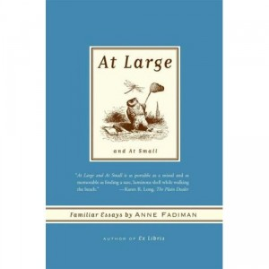

---
# http://learn.getgrav.org/content/headers
title: '"At Large and At Small" by Anne Fadiman'
slug: at-large-and-at-small-by-anne-fadiman
# menu: "At Large and At Small" by Anne Fadiman
date: 28-05-2012
published: true
publish_date: 28-05-2012
# unpublish_date: 28-05-2012
# template: false
# theme: false
visible: true
summary:
    enabled: true
    format: short
    size: 128
taxonomy:
    category: ["Books>Nonfiction"]
    tag: [5star,Anne Fadiman,essays]
author: aaron
metadata:
    author: aaron
#      description: Your page description goes here
#      keywords: HTML, CSS, XML, JavaScript
#      robots: noindex, nofollow
#      og:
#          title: The Rock
#          type: video.movie
#          url: http://www.imdb.com/title/tt0117500/
#          image: http://ia.media-imdb.com/images/rock.jpg
#  cache_enable: false
#  last_modified: true

---

**Rating:** 5/5

Anne Fadiman, *At Large and At Small: Familiar Essays by Anne Fadiman* (New York: Farrar, Straus, and Giroux, 2007).

Another delightful read. While not as intentionally hilarious as *[Ex Libris](../ex-libris-by-anne-fadiman "“Ex Libris” by Anne Fadiman")*, it certainly has it’s guffaw-inducing moments. She’s a tremendous writer and succeeds well at creating vivid imagery. This book is her contribution to the genre of the “familiar essay,” a genre that is intended as an intimate conversation between the author and a single reader. She covers topics from ice cream to coffee and from her crush on Charles Lamb to 9/11. My personal favourites are the essays on ice cream and on being a night owl. My favourite feature, though, is the annotated bibliography at the back separated by essay!! My to-read list just doubled! If you like this genre—and what’s not to like?—then you should certainly get your hands on this collection.

