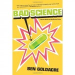

---
# http://learn.getgrav.org/content/headers
title: '"Bad Science" by Ben Goldacre'
slug: bad-science-by-ben-goldacre
# menu: "Bad Science" by Ben Goldacre
date: 11-06-2011
published: true
publish_date: 11-06-2011
# unpublish_date: 11-06-2011
# template: false
# theme: false
visible: true
summary:
    enabled: true
    format: short
    size: 128
taxonomy:
    category: ["Books>Nonfiction"]
    tag: [4star,Ben Goldacre,science]
author: aaron
metadata:
    author: aaron

---

**Rating:** 4/5

Ben Goldacre,* Bad Science: Quacks, Hacks, and Big Pharma Flacks* (Toronto, ON: McClelland & Stewart, 2010).

I first saw Ben Goldacre on YouTube, where I saw his stand-up comedy routine in which he talks about the placebo effect. I decided to give his book a go. I liked it, but it came across overall as far too rantish for my taste. He does accomplish his goal, but he could have addressed some important issues at greater length.

His goal is to educate readers about the vast amount of “bad science” all around us. He has a particular beef with the media and their insistence on hyping scare stores that have little grounding but then ignoring all the solid reassuring evidence that comes out later. His main case studies involve cosmetics, homeopathy, nutritionists, pharmaceutical companies, and finally the MMR vaccination scares. He tries to help readers understand how the scientific method works, how evidence-based studies should be read and understood, and how statistics can be interpreted in wildly different ways. He does do a decent job of this, but there are other books that do it better ([here’s one, for example](../the-unfinished-game-by-keith-devlin "“The Unfinished Game” by Keith Devlin"); [oh, and this one too](../good-calories-bad-calories-by-gary-taubes "“Good Calories, Bad Calories” by Gary Taubes")). The book is intended to be more entertaining, though, than profoundly educational. It’s still a worthy read (the placebo effect chapter was fascinating); our society does indeed suffer with innumeracy. I completely agree with him that the media bears a disproportionate amount of blame for the many misunderstandings and outright lies that still circulate.

The book is quite short and it’s an easy read. I can’t not recommend it. By the end, though, my ears were getting a little tired of all the yelling.

