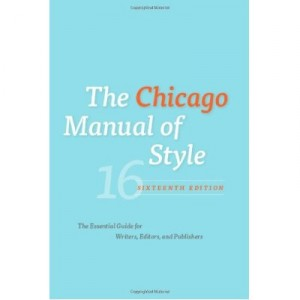

---
# http://learn.getgrav.org/content/headers
title: '"Chicago Manual of Style," 16th ed.'
slug: chicago-manual-of-style-16th-ed
# menu: "Chicago Manual of Style," 16th ed.
date: 16-05-2012
published: true
publish_date: 16-05-2012
# unpublish_date: 16-05-2012
# template: false
# theme: false
visible: true
summary:
    enabled: true
    format: short
    size: 128
taxonomy:
    category: ["Books>Nonfiction"]
    tag: [5star,editing,University of Chicago Press]
author: aaron
metadata:
    author: aaron
#      description: Your page description goes here
#      keywords: HTML, CSS, XML, JavaScript
#      robots: noindex, nofollow
#      og:
#          title: The Rock
#          type: video.movie
#          url: http://www.imdb.com/title/tt0117500/
#          image: http://ia.media-imdb.com/images/rock.jpg
#  cache_enable: false
#  last_modified: true

---

**Rating:** 5/5

 University of Chicago Press, *The Chicago Manual of Style*, 16th ed. (University of Chicago: 2010).

It’s unusual to “review” reference works, perhaps, but the Chicago Manual of Style (CMOS, or the “orange bible” [don’t let the dust cover fool you, the book is actually bright orange]) is too exceptional to not mention here. While in my line of work there are sections that see constant, recurring use, I’ve only read the entire 1000+ pages cover to cover three times: I finished the third time today.

One thing that seems to surprise people about editors is that they look stuff up all the time. Good editors do not sit as judge, jury, and executioner, enforcing strictly their specific views on grammar, usage, and style. Style is essentially arbitrary, and there is not always a strictly right or wrong way to do something. Editors work with best practices—traditional ways of communicating effectively, which change slowly over time. To this end we refer endlessly to good dictionaries (that help us not only with nuances of meaning but with issues of hyphenation [*byproduct* or *by-product*], change of use over time [in 1880, was it *Northwest Territories* or *North-West Territories*], and syllabification), culture-specific usage guides (to help identify idiomatic uses of common expressions, list common prepositions and their nuances, and elucidate sticky issues like the difference between *lie* and *lay*), and style guides (which cover the gamut from sparse to encyclopedic). As its title suggests, CMOS is a style guide. Well, not just *a* style guide, but *the* style guide—the biggest, most comprehensive, and perhaps most referenced and best known of them all.

If you want to be a writer or to work at all in the production of textual works (whether for the web, e-books, or traditional print publishing), this is an essential book to have access to and at least a passing familiarity with. You can also subscribe to the [online edition](http://chicagomanualofstyle.org). Those that already know the book can stop here. If you’d like to know more about what the book contains, click the “More” link below and continue on.

Perhaps the best way to show you the sorts of things CMOS covers is to go through the table of contents. It’s split into three main divisions, entitled “The Publishing Process,” “Style and Usage,” and “Documentation,” followed by some very helpful back matter.

The first part, “The Publishing Process,” goes through what a book and periodical are, what parts they generally contain, and in what order they generally appear. It talks about the stages of production you can expect and even provides an excellent section on copyright and permissions (geared towards a US audience, but still useful elsewhere). Here you’ll find answers to questions like

- Where does a book epigraph generally go in relation to the preface?
- What are some general best practices for preparing a manuscript for submission to a publisher?
- What are the sorts of things a manuscript editor is going to do and look for?
- What is the difference between a manuscript/copy editor and a proofreader?
- What are general best practices for tables and figures and their captions?
- Even if I’m not publishing in the US, what are the sorts of issues surrounding rights and permissions I should be aware of?

The second part, “Style and Usage,” comprises the bulk of the book. It contains the following subsections:

- Grammar and Usage - What are the parts of speech exactly (e.g., nouns, adjectives, adverbs, etc.)?
- What is the difference between grammar and usage?
- How can I write in a bias-free way?

- Punctuation - What is the correct way to use a semicolon?
- Should punctuation go inside or outside of the closing quotation mark?
- What are all the ways you can use a comma? (And what the heck is a coordinating conjunction?)
- Are there really 3 types of dashes?

- Spelling, Distinctive Treatment of Words, and Compounds - What’s the correct way to form the plural of numbers? of italicized terms? of proper names?
- What about the possessive?
- What are “scare quotes” and when can I use them?
- When do I need to hyphenate compound adjectives?

- Names and Terms (I love this section) - So is it the Pope or the pope?
- How do I write out epithets (like Ivan “the Terrible”)?
- Is it Western Canada or western Canada?
- How do I capitalize cultural periods, academic subjects, religious terms and offices, or scientific terms?
- Do I italicize the title of a book? What about the title of a poem? What about a painting?

- Numbers - Should I write 400 or four hundred?
- What are SI units and prefixes, and how are they used?
- How are large (and very small) numbers notated around the world?
- When and how should I use Roman numerals?

- Abbreviations - What are the accepted abbreviations for books of the Apocrypha, geographical locations, or scientific terms?
- Do I need periods between each letter? Do I need space, too?

- Foreign Languages - What are the best practices for dealing with non-latin alphabets?
- How do French texts most commonly delineate dialogue?
- Generally speaking, how should I hyphenate Italian words?
- What are best practices for dealing with Chinese and Japanese characters?

- Mathematics in Type - What needs to be italicized?
- Should I put space around all the operators, or only some of them?
- How should I mark up math copy for the typesetter?
- What is Dirac Notation?
- Are the multiplication cross (×) with the multiplication dot (⋅) always interchangeable?

- Quotations and Dialogue - Should I run the quote in or block it out?
- Do block quotes need quotation marks?
- Does the source citation go before or after the closing punctuation mark?
- How should I use the ellipsis?

The third section, “Documentation,” goes through everything you could ever want to know about bibliographies, reference lists, and indexing. Every writer should read these sections thoroughly.

The back matter includes an appendix that goes through the nitty-gritty of digital production management (XML workflows, for example), an extensive glossary, a huge and invaluable bibliography, and one of the best indexes I have ever had the pleasure of using.

CMOS is a must-have reference work for anyone that works with text.

