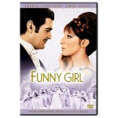
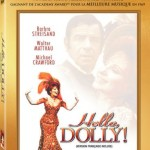

---
# http://learn.getgrav.org/content/headers
title: 'Classic Streisand: "Funny Girl" &#038; "Hello, Dolly!"'
slug: classic-streisand-funny-girl-hello-dolly
# menu: Classic Streisand: "Funny Girl" &#038; "Hello, Dolly!"
date: 10-04-2011
published: true
publish_date: 10-04-2011
# unpublish_date: 10-04-2011
# template: false
# theme: false
visible: true
summary:
    enabled: true
    format: short
    size: 128
taxonomy:
    category: ["Movies & TV",Music]
    tag: [5star,Barbara Streisand,musicals]
author: aaron
metadata:
    author: aaron

---

**Rating:** 5/5
   
I love musicals. I particularly love musicals with strong stories. Adele & I have recently discovered Netflix, and one of the best things about it is the wealth of older movies we can watch for next to nothing. This weekend we sat down and watched two favourites of mine, “Funny Girl” and “Hello, Dolly!” Streisand has one of the most expressive vocal instruments I have ever heard. I love to hear her sing. “Funny Girl” is not a happy story, but it’s a strong one, and some of the numbers are just incredible. “Hello, Dolly!” is hilarious and works despite the presence of the much loathed (by me) Michael Crawford. And no matter how often I see it, I still get chills every time Louis Armstrong turns around and starts to sing.

If by some tragedy you have never seen these movies, you really must. Even if you have, it’s probably time to watch them again!

