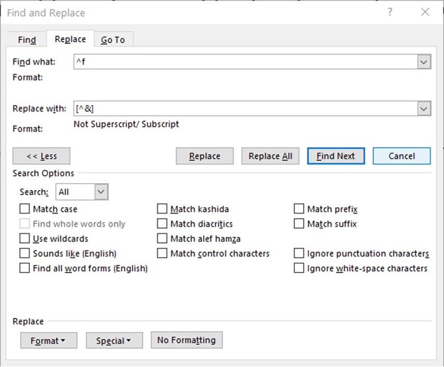
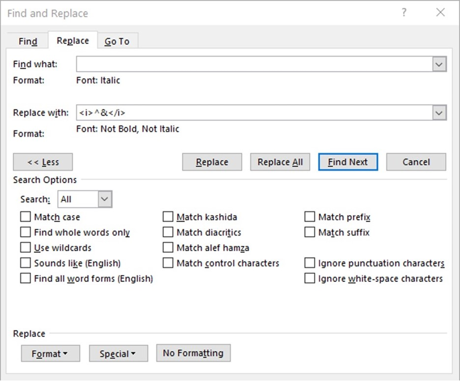
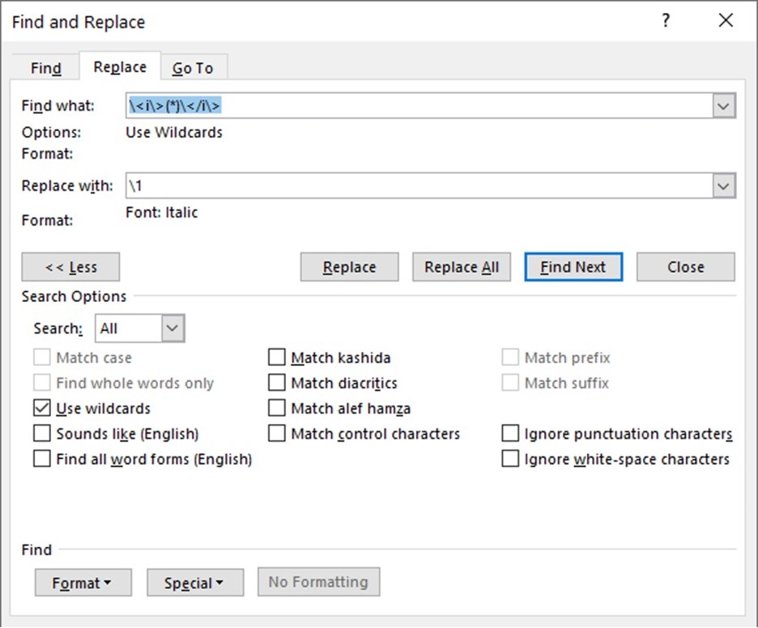

**This article was [originally published on *The Editors' Weekly*](https://blog.editors.ca/?p=7297), the official blog of the [Editors' Association of Canada](http://editors.ca).**

===

Recently, I’ve seen some problems involving global text edits that were easily
solved with Microsoft Word’s **Advanced Find and Replace** feature. Spending
some time learning the ins and outs of this feature will more than pay off when
you’re able to do something in minutes that would take you hours to do manually.

## Find and replace

Let’s say you want to change all your footnotes from superscript numbers to
normal numbers enclosed in square brackets.

The caret combined with a lowercase "f" (`^f`) will find all footnote
markers, be they symbols, letters or numbers. And the caret combined with the
ampersand (`^&`) represents whatever text was matched by the **Find what**
clause. Click **Special** to bring up a list of other special wildcard
characters (`[]{}<>()-@?!\*\`) and other special characters (tab, caret, em
dash, etc.) that you can search for.

Here’s another example that will lead into the next topic. Let’s say you need to
code all your italic text using HTML.

Again, we see the usefulness of the caret and ampersand combined (`^&`). And
we also see that we can leave the **Find what** field blank to search just for
formatting! Magically, all our italic text becomes `<i>italic</i>`.

## Wildcards

To convert that coded text back into italic, things get a little more
complicated. If you check the **Use wildcards** checkbox, you’ll see the options
available in **Special** have changed. What this unlocks is a subset of the
language called "regular expressions" (we’re getting there). The feature that I
use the most is the ability to get more granular than simply `^&`.

First, we enter the codes in the **Find what** field. Because angle brackets (`<>`) have a special meaning, we must "escape" the brackets by inserting a
backslash in front of them. In the middle, we enter an asterisk enclosed in
parentheses `(*)`. The asterisk allows you to search for all characters
between those codes, and the parentheses groups those characters for later
reference.

We reference that group of characters in the **Replace with** field. We can’t
just enter `^&` because that would keep and italicize the codes. All we want
to italicize are those characters between them. Because there’s only one set of
parentheses, we simply insert `\1`, referencing the first (or only) group in
the **Find what** field. But if you have multiple sets of parentheses, you
reference them with `\2`, `\3`, and so on.

Note: Wildcard searches will sometimes not work properly if **Track Changes** is
active.

## Regular expressions

Frustratingly, Word does not implement the full power of [the language known as
"regular expressions."](https://en.wikipedia.org/wiki/Regular_expression) For
that, you have to turn to other software. If you’re working in Adobe InDesign,
then you’re in luck. [Its regular expression support is
robust.](https://indesignsecrets.com/resources/grep) Otherwise, I have often
copied text into a text editor that supports regular expressions to do some work
(I personally prefer [Visual Studio Code](https://code.visualstudio.com/)), and
then I’ve moved the text back into Word. (I do this with tables a lot.)

There are many things you can do using regular expressions that you can’t do in
Word. The most invaluable would be positive and negative [lookaheads and
lookbehinds](https://www.rexegg.com/regex-lookarounds.html).

Consider the following idiosyncratic citation style:

> O’Connell, S.C. (1994): Geological history of the Peace River Arch; *in* Geological atlas of the Western Canada Sedimentary Basin, G.D. Mossop and I. Shetsen (comp.), Canadian Society of Petroleum Geologists and Alberta Research Council, p. 431–438 [May 2016].

See that italic "*in*"? Positive lookbehinds to the rescue: `(?<=\;\ )in`
matches *just* the word "in" if and only if it is preceded by a semicolon and a
space. Just apply the formatting.

## More information

For more information, simply search for terms such as "msword wildcards" and
"regular expression tutorial." Here are a few resources to start with:

-   WordMVP wildcard tutorial with examples:
    <https://wordmvp.com/FAQs/General/UsingWildcards.htm>

-   A regular expression primer:
    <https://ryanstutorials.net/regular-expressions-tutorial/>

-   Real-time regular expression tester: <https://regexr.com/>

-   [Editing software
    packages](https://activevoice.editors.ca/spring-summer-2018/tech-talk-editing-technology/)
    that include features to simplify global edits

Any tips, tricks or special tools that *you* use? Please share below!
