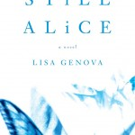

---
# http://learn.getgrav.org/content/headers
title: 'Guest Post: "Still Alice" by Lisa Genova'
slug: guest-post-still-alice-by-lisa-genova
# menu: Guest Post: "Still Alice" by Lisa Genova
date: 06-06-2011
published: true
publish_date: 06-06-2011
# unpublish_date: 06-06-2011
# template: false
# theme: false
visible: true
summary:
    enabled: true
    format: short
    size: 128
taxonomy:
    category: ["Books>Fiction"]
    tag: [5star,Alzheimer's,guest post,Lisa Genova]
author: adele
metadata:
    author: adele

---

This is our first guest post. My wife, Adele, has been doing some reading and wanted to share her thoughts with all of you. Here we go!

**Rating:** 5/5

Lisa Genova, *Still Alice* (New York: Pocket Books, 2009).

A wonderful and educational read! This is a story of how one Alice discovers she has Alzheimer’s and how that affects not only her but those she loves. What makes this book brilliant is how the author manages to truly give a very real first-person glimpse of what someone with a disability (Alzheimer’s or any other) goes through as they watch themselves morph into something foreign and undesirable to them and others. It is so hard to understand how a person feels as they lose their life to a disability or disease. Whether the effects come on slowly or quickly, the patient still goes through several mental states. Lisa Genova has given a voice to the disabled! I appreciate all the effort she went through to create such a detailed and accurate (from my disabled perspective) account of that process. I strongly recommend this book to everyone! It will give you insights into the life of disabled persons that are very difficult to come by except for becoming disabled yourself.

