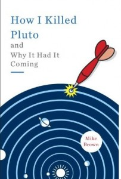

---
# http://learn.getgrav.org/content/headers
title: '"How I Killed Pluto" by Mike Brown'
slug: how-i-killed-pluto-by-mike-brown
# menu: "How I Killed Pluto" by Mike Brown
date: 13-05-2012
published: true
publish_date: 13-05-2012
# unpublish_date: 13-05-2012
# template: false
# theme: false
visible: true
summary:
    enabled: true
    format: short
    size: 128
taxonomy:
    category: ["Books>Nonfiction"]
    tag: [3star,Mike Brown,science]
author: aaron
metadata:
    author: aaron

---

**Rating:** 3/5

 Mike Brown, *How I Killed Pluto and Why It Had It Coming* (New York: Spiegel & Grau, 2010).

When Pluto got demoted, I remember hearing about it, but I apparently didn’t care enough to do any reading about it. I had no idea how it happened or why. So when I saw this book sitting on the shelf, I felt a responsibility to pick it up. It’s a personal (IMO, too personal) account of the discoveries and events that led up to Pluto’s demise and some of the fallout therefrom. The reality is, the book could have been half the length. The first half was a little painful. No disrespect to Dr. Brown, but I just didn’t care about his childhood, early relationships, and first weekend getaway with his eventual wife. The bits about his daughter in the second half were more bearable for me, but that’s more because I love kids than because they were somehow pertinent to the story. I understand that all that is part of *his* story, and I respect that, but the reality was I didn’t pick up this book to learn about Dr. Brown. I just wanted to get the details around Pluto’s “death.” So if you do want to get a detailed account of how all that went down, then this book will certainly give you that, but be prepared to skim a lot of more personal details as well.

