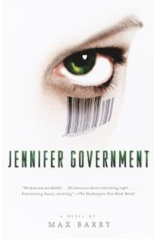

---
# http://learn.getgrav.org/content/headers
title: '"Jennifer Government" by Max Barry'
slug: jennifer-government-by-max-barry
# menu: "Jennifer Government" by Max Barry
date: 31-08-2006
published: true
publish_date: 31-08-2006
# unpublish_date: 31-08-2006
# template: false
# theme: false
visible: true
summary:
    enabled: true
    format: short
    size: 128
taxonomy:
    category: ["Books>Fiction"]
    tag: [3star,Max Barry,scifi]
author: aaron
metadata:
    author: aaron

---

**Rating:** 3/5

Max Barry, *Jennifer Government* (Vintage, 2004).

This is a futuristic look at a fully capitalistic world where citizens are truly defined by what they do. It’s part political commentary and part crime thriller. It’s well written with well defined characters and some interesting ideas. I will warn you, however, that Max’s characters have no qualms about swearing and some quite profusely so you have been warned. If you enjoy crime fiction, and especially if you like a little political satire thrown in, then I recommend this book.

