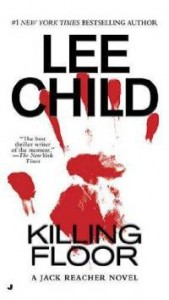

---
# http://learn.getgrav.org/content/headers
title: '"Killing Floor" by Lee Child'
slug: killing-floor-by-lee-child
# menu: "Killing Floor" by Lee Child
date: 22-06-2012
published: true
publish_date: 22-06-2012
# unpublish_date: 22-06-2012
# template: false
# theme: false
visible: true
summary:
    enabled: true
    format: short
    size: 128
taxonomy:
    category: ["Books>Fiction"]
    tag: [4star,detective,Jack Reacher,Lee Child]
author: aaron
metadata:
    author: aaron

---

**Rating:** 4/5

Lee Child, *Killing Floor* (New York: Jove Books, 1997).

Apparently I’m a little late coming to the Jack Reacher party. Both my father and one of my sisters has been talking up these book for a long time, and I’ve just never made the time to read them. Well I finally did, and wow, I’ve been missing out!

I do enjoy detective fiction. I even took a summer class in university on that very subject. We read a dozen or so books in roughly chronological order. What I came away with from that initial reading list, though, was that modern authors seem to think tough guys have to say the F word at least once every so many sentences and that readers can’t possibly appreciate a sex scene unless every single aspect of the encounter is laid out in lurid detail. (I never did finish the last book on our reading list. I was appalled.) While I knew my dad or sister wouldn’t read or recommend a book like that, that impression was strong enough that I have avoided most detective-style books written after I was born, essentially. (I made exceptions for Phillip K. Dick.)

Lee Child does an excellent job of portraying an awesome tough-guy character without the gratuitous language and porn. The book is violent and describes some pretty disturbing stuff, but for me anyway, it’s not over the top. The best analogy I can think of right now is the difference between the original *CSI* (violent but restrained) and *Criminal Minds* (over the top)—if that helps.

I know this is stating the obvious, but there is so much you can do in a book that you can never do on film. I guess it was just particularly stark this time because the material in the book is the sort of thing you see in movies all the time. Jack Reacher is a Dirty Harry–type character. The book is full of pithy quips that made me laugh out loud (in the “hoh boy, awesome” kind of way). But on film that’s all you get is what is spoken. The best part is what’s going on in his head, how he thinks.

Child employs a writing style not unexpected in this type of fiction. Short sentences. Lots of fragments. Lots of action. There’s no fluff here. Everything matters. He’s true to the mystery-fiction ideal of “fair play,” which requires the author to provide the reader with all the information necessary for figuring out the plot twists. As the reveals come, the reader should be able to sit back and go, “Why didn’t I see that?” When the story is all over, the reader should be able to see how it all fits together. Child is also adept at imagery. You are there. You are seeing what Reacher sees. You are a part of the action. Right from the first sentence, Child hooks you and you just have to keep reading.

Now, there are obviously detractors. Yes, the characters do a lot of shrugging. Yes, Reacher is superhuman. Yes, the plot is not particularly deep nor the mystery all that impossible to figure out. Some even were upset by the whole Reacher/Roscoe denouement. In my view, these complaints are akin to deriding the latest *Avengers* movie for not being realistic, or rolling your eyes as the characters in *Crouching Tiger, Hidden Dragon* fly around, or turning to your buddy in the theatre and complaining that in *Wanted* they fire off way more ammunition than those guns can actually hold. This book is about fun. It’s not high art.

If you like detective/mystery stories, and you don’t mind a little blood, then you will enjoy *Killing Floor*, more specifically, you will enjoy Jack Reacher. I can’t wait for the second book to come in.
