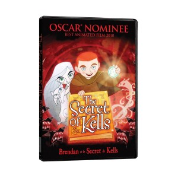

---
# http://learn.getgrav.org/content/headers
title: 'Movies: Secret of Kells'
slug: movies-secret-of-kells
# menu: Movies: Secret of Kells
date: 03-04-2013
published: true
publish_date: 03-04-2013
# unpublish_date: 03-04-2013
# template: false
# theme: false
visible: true
summary:
    enabled: true
    format: short
    size: 128
taxonomy:
    category: ["Movies & TV"]
    tag: [5star]
author: aaron
metadata:
    author: aaron

---

**Rating:** 5/5

Last night Adele and I watched an animated movie called “The Secret of Kells.” What an awesome film! The animation style is very different and the overall design is fantastic. (I *loved* the wolves!)

The story is an imagination of how the gorgeous [Book of Kells](http://en.wikipedia.org/wiki/Book_of_Kells) was created. (If you’re not familiar with the book, I actually recommend reading the Wikipedia article before watching the movie.) I was just enthralled from beginning to end. I highly recommend it!

Note: While this is an animated feature, it’s not a kids movie. There are some very scary scenes.

