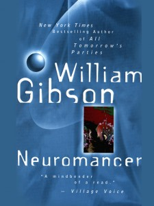

---
# http://learn.getgrav.org/content/headers
title: '"Neuromancer" by William Gibson'
slug: neuromancer-by-william-gibson
# menu: "Neuromancer" by William Gibson
date: 07-10-2010
published: true
publish_date: 07-10-2010
# unpublish_date: 07-10-2010
# template: false
# theme: false
visible: true
summary:
    enabled: true
    format: short
    size: 128
taxonomy:
    category: ["Books>Fiction"]
    tag: [2star,scifi,William Gibson]
author: aaron
metadata:
    author: aaron

---

**Rating:** 2/5

William Gibson, *Neuromancer* (Ace, 1984).

I’ve always been a fan of the “cyberpunk” mythos, but I have just never gotten around to reading the archetypal book that really started it all, *Neuromancer*. I finally did.

It’s a pretty quick read (250ish pages in the Ace special edition). It’s written in a gritty, old-school detective type of style. The dialogue alternates back and forth at lightning speed and requires that you actually pay attention if you want to follow it all. It’s about an old washed up net cowboy who’s hired by a mysterious man for an equally mysterious “run.” I’m no good at plot synopses, so essentially the story is about this cowboy and the “street samurai” this mysterious mastermind has hired, the complications during the operation, revelations are made about this mysterious man and the real motives behind what they’re doing, and then finally the denouement.

The story itself is nothing special. They writing style is fast paced, concise, and full of unconventional, but for the most part very expressive, metaphor. Take the first line for example:

> The sky above the port was the color of television, tuned to a dead channel.

Ultimately I can’t say that I would actually recommend this book to people. If you’re interested in the genre, it’s an interesting piece of history (ironically enough), but otherwise, you’re not missing anything. I think the reason I was so dissatisfied at the end was that the book was universally dark and dystopian. There was not a single ray of light or character that was clearly likable or relatable. There were clear pro- and antagonists, but every one of them was dark, dirty, and murderous. There were no “heroes,” not even flawed ones. The characters were without exception self-absorbed and only used those around them. They tried to hint at a possible “real” love story between Case and Linda, but those few pages were not enough to undo what was built during the rest of the story. These are characters you pity, not root for or want to emulate.

NOTE: The book is indeed gritty. I almost put it down at one point. There is one short but graphic sex scene and numerous instances of explicit sexual references. There is a smattering of F\* bombs as well.

Next up, the works of H. P. Lovecraft! Very excited!
