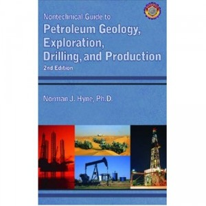

---
# http://learn.getgrav.org/content/headers
title: '"Nontechnical Guide to Petroleum Geology, Drilling and Production" by Norman J. Hyne'
slug: nontechnical-guide-to-petroleum-geology-drilling-and-production-by-norman-j-hyne
# menu: "Nontechnical Guide to Petroleum Geology, Drilling and Production" by Norman J. Hyne
date: 02-05-2012
published: true
publish_date: 02-05-2012
# unpublish_date: 02-05-2012
# template: false
# theme: false
visible: true
summary:
    enabled: true
    format: short
    size: 128
taxonomy:
    category: ["Books>Nonfiction"]
    tag: [3star,Norman J. Hyne,science]
author: aaron
metadata:
    author: aaron

---

**Rating:** 3/5

Norman J. Hyne, *Nontechnical Guide to Petroleum Geology, Drilling and Production* (Tulsa: Pennwell, 2001).

In my new job I edit materials surrounding the regulation of natural resource production in Alberta. While I have a background in science in general, oil and gas is not something I’ve had lots of experience with. Fortunately this book was sitting on my desk. The book is exactly what it says it is. It starts by explaining the geological foundation of hydrocarbons and goes through the technicalities of how these resources are found, assessed, and produced. It goes through all the terminology and is replete with maps, photos, and drawings to make everything as clear as possible. The glossary is awesome. It’s not a quick read (almost 600 pages all said), but it was very informative and well structured. I’m still no expert, but it really helped me wrap my head around the vocabulary and some of the fundamental concepts. The hand drawings can be quite whimsical. I got a good chuckle out of two in particular: figure 20-16 on page 354 has two hand-drawn bunnies standing on either side of the oil pump, and figure 22-1 on page 376 shows a shark attacking a offshore mining rig.

