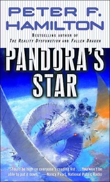

---
# http://learn.getgrav.org/content/headers
title: '"Pandora&#8217;s Star" by Peter F. Hamilton'
slug: pandoras-star-by-peter-f-hamilton
# menu: "Pandora&#8217;s Star" by Peter F. Hamilton
date: 04-05-2013
published: true
publish_date: 04-05-2013
# unpublish_date: 04-05-2013
# template: false
# theme: false
visible: true
summary:
    enabled: true
    format: short
    size: 128
taxonomy:
    category: ["Books>Fiction"]
    tag: [3star,Peter F. Hamilton,scifi]
author: aaron
metadata:
    author: aaron

---

**Rating:** 3/5

Peter F. Hamilton, *Pandora’s Star*, Commonwealth Saga #1 (New York: Ballantine Books, 2004).

This thousand-page tome is the first of two novels in the Commonwealth Saga. It’s apparently popular in Calgary because I had to keep returning it to the library because of holds. It took me three attempts, but I finally got through it.

Overall, Hamilton is a good writer. The story is fast moving and even compelling at parts. The story is epic, though, and requires some concentration to keep it all in your head. Hamilton’s “failure” here is the information overload. I couldn’t count the number of individual characters in this story, each grouped into one of what must be a dozen primary narrative threads. Each of those threads have a substantial number of episodes. And even many episodes are divided further into multiple scenes. The problem is that for the first 75% of the book, you are constantly cycling between different episodes (yes, some of the episodes are parallel) of the primary threads. It’s not until the last quarter of the book that most of these threads finally come together and are treated in some sort of continuous fashion. The disjointedness starts to get a little exhausting.

The result is a story that feels fast paced and at times exciting, but the sheer number of characters makes it impossible for the reader to really invest. Halfway through the book I found myself asking why bother? Why am I supposed to care about these characters? Somebody dies and you don’t even blink. Certainly readers will gravitate to a few for different reasons, but overall you’re left cold. You never get a chance to really explore any one character. At the end of the book, Hamilton even introduces a whole new cast whose sole purpose is to manipulate the reader’s feelings when the bombs start flying. It fails because by the time you meet these people, your head’s about ready to explode just trying to remember everybody’s names to that point.

While the cliffhanger conclusion was expected, instead of feeling compelled to read the next book, the huge number of loose ends and unanswered questions only made me feel even more tired. It didn’t help that the fundamental ideas of the story were not that compelling. The Primes were interesting, but you don’t meet them until halfway in. The rest of the tech was pretty standard fare.

And while Hamilton’s portrayals of sexuality were not as explicit as those of, say, [Iain M. Banks](../against-a-dark-background-by-iain-m-banks "“Against a Dark Background” by Iain M. Banks"), he still goes way too far for my taste. I found all of it gratuitous, not adding anything to the story. At least [Banks’s *Use of Weapons*](../use-of-weapons-by-iain-m-banks "“Use of Weapons” by Iain M. Banks") ties the sexuality into the fundamental premise of the book. It is possible to portray love and passion without resorting to four-letter words. It’s possible to bring sexuality into a story without making you hope nobody is reading over your shoulder. (I’m looking at you, crazy people reading *Fifty Shades* on the bus!) And to make it even worse, the dialogue surrounding these scenes is the cheesiest, most unrealistic, and most blatantly adolescent-male-gaze oriented tripe I’ve ever read! There were a few points at the end (Justine and Kazimir are the worst) where I was just howling with laughter. Adele about died as I read some of it to her. I’m sorry, but people just don’t talk like that.

Ooo! I found the best part. Get out your barf bags!

> “Where are you going? You’re not going now?” [Justine]
> 
> “I have to.” He shrugged, almost blushing. “I hadn’t expected to spend the night.” [Kazimir]
> 
> She felt her own cheeks coloring at that. “I want you to spend every night here, Kazimir. I want every night to be like last night. I don’t do this anymore…Damnit, I thought…I didn’t think I could care for someone like this, not anymore. But you…”
> 
> “When this is over, when nothing lies between us, I will be yours for as long as you’ll have me.”
> 
> “Damnit.” Her eyes were watering.
> 
> “Don’t cry. I won’t have my beautiful angel cry for me. I’m not worth it.”
> 
> “You are. You are so worth it. You have no idea”
> 
> He finished dressing, then held her for a long moment. “I will come back for you,” he promised gravely. “I swear it.”

No joke. Verbatim.

Anyway, overall it’s a perfectly decent sci-fi read, but it’s nothing special. Prepare to expend some mental energy keeping track of everything. I will not be reading the second book nor, methinks, anything else by Mr. Hamilton.

