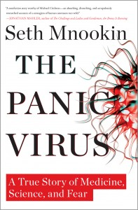

---
# http://learn.getgrav.org/content/headers
title: '"Panic Virus" by Seth Mnookin'
slug: panic-virus-by-seth-mnookin
# menu: "Panic Virus" by Seth Mnookin
date: 15-05-2012
published: true
publish_date: 15-05-2012
# unpublish_date: 15-05-2012
# template: false
# theme: false
visible: true
summary:
    enabled: true
    format: short
    size: 128
taxonomy:
    category: ["Books>Nonfiction"]
    tag: [4star,health,science,Seth Mnookin]
author: aaron
metadata:
    author: aaron

---

**Rating:** 4/5

Seth Mnookin, *The Panic Virus* (New York: Simon & Schuster, 2011).

This book is a history of both vaccination itself and its opponents. The take-away message is that the media is not the place to go for truly balanced and accurate information about science and health. They are far more interested in ratings and catchy headlines than truth. Epidemiology is not something you can just pick up from the University of Google. The author appeals passionately for a return to rational thought and scientific rigour. He doesn’t say that doctors are perfect or that they know everything. His account highlights the mistakes made along the way. But these mistakes are of a PR nature, a failure to properly communicate the risks and benefits associated with vaccination.

Another vital point in his argument is that choosing not to vaccinate is *not* a purely personal decision—one that doesn’t affect anybody else. Infants not yet old enough for certain vaccines, as well as those for whom vaccines are not effective (immuno-suppressed individuals), are in ever greater numbers contracting (and dying from) these horrible diseases because of the loss of “herd immunity” protection.

I fully recognize the polemics surrounding this debate. (I have family members on both sides.) So I won’t say anything more than that I am personally convinced that the benefits of vaccination far, far outweigh the risks. I highly recommend this book.
