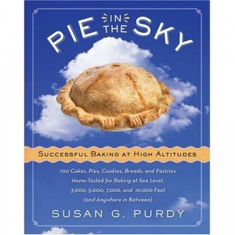

---
# http://learn.getgrav.org/content/headers
title: '"Pie in the Sky" by Susan Purdy'
slug: pie-in-the-sky-by-susan-purdy
# menu: "Pie in the Sky" by Susan Purdy
date: 27-07-2012
published: true
publish_date: 27-07-2012
# unpublish_date: 27-07-2012
# template: false
# theme: false
visible: true
summary:
    enabled: true
    format: short
    size: 128
taxonomy:
    category: [Food,"Books>Nonfiction"]
    tag: [4star,Susan G. Purdy]
author: aaron
metadata:
    author: aaron

---

**Rating:** 4/5

Susan G. Purdy, *Pie in the Sky: Successful Baking at High Altitudes; 100 Cakes, Pies, Cookies, Breads, and Pastries Home-Tested for Baking at Sea Level, 3000, 5000, 70000, and 10000 feet (and Anywhere in Between)* (New York: William Morrow, 2005).

If you bake, and you live above 3000 feet, then this book is for you. It’s an excellent resource for concrete, trustworthy advice about high-altitude baking. I love that every recipe has been tested. Calgary is at about 3500 feet, so the changes I need to make are minor, but it’s nice to have some solid information to turn to. This is an excellent resource!
