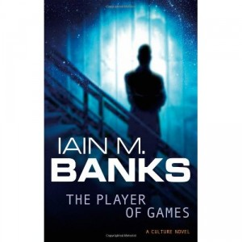

---
# http://learn.getgrav.org/content/headers
title: '"Player of Games" by Iain M. Banks'
slug: player-of-games-by-iain-m-banks
# menu: "Player of Games" by Iain M. Banks
date: 25-03-2012
published: true
publish_date: 25-03-2012
# unpublish_date: 25-03-2012
# template: false
# theme: false
visible: true
summary:
    enabled: true
    format: short
    size: 128
taxonomy:
    category: ["Books>Fiction"]
    tag: [2star,Iain M. Banks,scifi]
author: aaron
metadata:
    author: aaron

---

**Rating:** 2/5

Iain M. Banks, *The Player of Games* (London: Orbit, 1989).

Being a gamer myself, I had high hopes for this book. I was a little disappointed. It was pretty good overall, but the specific game aspects were highly romanticized and frustratingly non-specific. I did find his views on randomness in games interesting. There wasn’t as much coarse language in this book as in the first, but the sexual innuendo was much stronger (bordering on explicit). The plot was pretty weak and not nearly as engaging as *Consider Phlebas*. This book almost put me off Banks altogether, but the first book was strong enough to make me want to read at least one more, though I won’t for a few months. I’ll be sure to report back when I do.

Basically, the plot centres around a great Culture game player and his going to a newly discovered society that completely revolves around a mind-bogglingly complex game. There’s a twist ending, but it’s neither particularly surprising nor interesting. I won’t recommend this book to most people.

