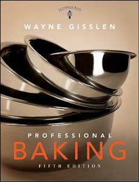

---
# http://learn.getgrav.org/content/headers
title: '"Professional Baking" by Wayne Gisslen'
slug: professional-baking-by-wayne-gisslen
# menu: "Professional Baking" by Wayne Gisslen
date: 27-07-2012
published: true
publish_date: 27-07-2012
# unpublish_date: 27-07-2012
# template: false
# theme: false
visible: true
summary:
    enabled: true
    format: short
    size: 128
taxonomy:
    category: [Food,"Books>Nonfiction"]
    tag: [5star,textbooks,Wayne Gisslen]
author: aaron
metadata:
    author: aaron
#      description: Your page description goes here
#      keywords: HTML, CSS, XML, JavaScript
#      robots: noindex, nofollow
#      og:
#          title: The Rock
#          type: video.movie
#          url: http://www.imdb.com/title/tt0117500/
#          image: http://ia.media-imdb.com/images/rock.jpg
#  cache_enable: false
#  last_modified: true

---

**Rating:** 5/5

Wayne Gisslen, *Professional Baking*, 5th ed. (New Jersey: John Wiley & Sons, 2009).

I love this book! This is a textbook used in cooking schools. It’s perfect if you really want to learn how baking works from the ground up. I love, love, love it! Not only does it have all the standard recipes, it goes through in painstaking detail how they work, why they work, and what to do when things go wrong. This may well be the only cookbook I will ever need to buy (other than the *Professional Cooking* companion textbook, also coming to my door very soon)! There are lots of pictures and diagrams, a small bibliography, and some very useful appendices. It covers everything: breads, cakes, cookies, mousses—even chocolate and sugar work! If you like to bake, or you just want to learn how, this is *the* book to go out and find right now. The sixth edition has just come out, but it is twice the price of the fifth, so I went ahead and just bought the fifth edition. I love this book!

