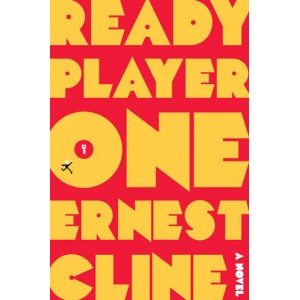

---
# http://learn.getgrav.org/content/headers
title: '"Ready Player One" by Ernest Cline'
slug: ready-player-one-by-ernest-cline
# menu: "Ready Player One" by Ernest Cline
date: 19-06-2012
published: true
publish_date: 19-06-2012
# unpublish_date: 19-06-2012
# template: false
# theme: false
visible: true
summary:
    enabled: true
    format: short
    size: 128
taxonomy:
    category: ["Books>Fiction"]
    tag: [4star,Ernest Cline,scifi]
author: aaron
metadata:
    author: aaron

---

**Rating:** 4/5

Ernest Cline, *Ready Player One* (New York: Crown Publishers, 2011).

Well the book was a fun read, but saccharine. Like the best Disney and Pixar films, *Ready Player One* is targetted to younger readers but cannot be fully appreciated except by older ones. Unfortunately, unlike movies like *Wall-E* (my favourite), *Finding Nemo*, and *Up*, *Ready Player One* lacks the grown-up “hook” that forms the foundation that supports the movies.

The book revels in the 80s, particularly in classic video games. I’m old enough (and was involved in computers young enough) to remember games like *Adventure* and what it was like to load games via cassette tape. I could totally relate to the rush of *Robotron*, and I let out a guffaw when (and because of how) the game *Joust* came up. I spent many hours in the arcade. D&D? I was totally there. I remember watching *Tron* on laserdisc. And there were some great allusions to 80s movies. (Though sometimes, for the sake of younger readers, he would insert these distracting asides explaining little things, like what a D&D module is. I would have preferred he just fully commit and let the readers figure it out.)

Make no mistake, though, the book is written for young adults. The language is simple, the plot uncomplicated, and the dialogue at times (especially at the end, when you really just want to get to the “good stuff”) tiresome. Grownups will enjoy the book for its nostalgia value, but don’t dig too deep. Sometimes you’ll just have to take a deep breath and look past the glaring improbabilities. The “love story” might be interesting to an adolescent, but grownups will find it quite cliché.

An experienced reader can expect to get through the text in about six hours. It’s a great book for younger folk because it is exciting enough to keep them interested but not so challenging as to be discouraging. (Note: There are a handful of scatalogical terms, a one-page reference to virtual sex, and one use of the verb “to fellate.” All things considered, though, it’s pretty mild.)

So in short, grownup 80s geeks (particularly gaming geeks) will enjoy the context (and guiltily enjoy a fast, uncomplicated adventure story that includes Ultraman and Mechagodzilla), younger readers will enjoy a decent story that takes place largely in a virtual, online world, and everybody else can safely skip the book for something else. If you like the idea of a romp through virtual worlds that is written *for* grownups, with deep and nuanced characters, real dialogue, and an engaging plot, I recommend instead [Tad Williams’s *Otherworld* tetralogy](../otherland-tetralogy-by-tad-williams "“Otherland” tetralogy by Tad Williams"). It’s top notch.
