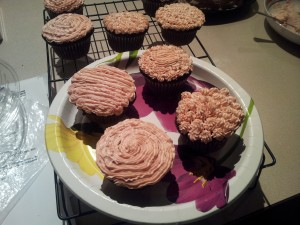

---
# http://learn.getgrav.org/content/headers
title: 'Recipes: Chocolate Pumpkin Cake'
slug: recipes-chocolate-pumpkin-cake
# menu: Recipe: Chocolate Pumpkin Cake
date: 11-06-2013
published: true
publish_date: 11-06-2013
# unpublish_date: 11-06-2013
# template: false
# theme: false
visible: true
summary:
    enabled: true
    format: short
    size: 128
taxonomy:
    category: [Food]
    tag: []
author: aaron
metadata:
    author: aaron

---

Original recipe: <http://gracessweetlife.com/2012/10/chocolate-pumpkin-cake-and-cupcakes-with-vanilla-bean-swiss-meringue-buttercream/>

I had a bunch of pumpkin left over from the [pumpkin cheesecake I made](../recipes-pumpkin-swirl-cheesecake "Recipe: Pumpkin Swirl Cheesecake"), and the person in the office that loves pumpkin ended up not loving cheesecake, so I had to make something else. The first place I went was [Grace Langlois’s excellent baking blog.](http://gracessweetlife.com) Her recipes have been very reliable and delicious! Well back in 2012 she posted a recipe for chocolate pumpkin cake, and I gave it a shot.

I only have two cupcake pans, so I made 2 dozen cupcakes and one 9&Prime; cake. This cake is super moist, so be sure to line the bottom of your cake pan with parchment. I can’t get over how moist and delicious this cake is. Even days later it was perfect. And her buttercream recipe turned out awesome (though I used vanilla extract instead of vanilla bean). The secret I think is the paddle attachment phase at the end. The buttercream I made in the past was the same basic recipe, but it lacked the consistency that the beating step brings.

This is an awesome recipe, especially if you want something chocolate but also something a little different. Definite keeper!

P.S. I will never do photos like Grace can, and the only pictures I have are quite dark. You can’t actually see any cake! But Adele did a great job with the icing so here’s the photo.

Frosted

