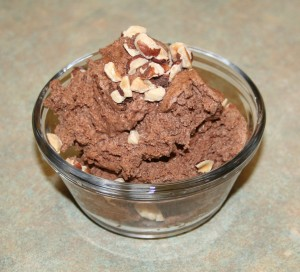

---
# http://learn.getgrav.org/content/headers
title: 'Recipes: Double Chocolate Brownie Semifreddo'
slug: recipes-double-chocolate-brownie-semifreddo
# menu: Recipes: Double Chocolate Brownie Semifreddo
date: 24-02-2012
published: true
publish_date: 24-02-2012
# unpublish_date: 24-02-2012
# template: false
# theme: false
visible: true
summary:
    enabled: true
    format: short
    size: 128
taxonomy:
    category: [Food]
    tag: []
author: aaron
metadata:
    author: aaron

---

Original recipe: <http://gracessweetlife.com/2010/07/donna-hays-double-chocolate-brownie-semifreddo/>

This worked out really nice. It’s super rich, just like the chocolate mousse, but it doesn’t have the same structure. At room temperature, it does start to “melt.” What’s wonderful is how easy it is to stir in whatever you like. It doesn’t require an ice cream maker, and it’s just different enough from the mousse to have a place in the cookbook.

We didn’t have brownies, so I was going to fold in toasted hazelnuts. We wanted to see how it tasted without. Verdict? It really needs something to break up the flavour. Next time I’ll be sure to fold in nuts or M&Ms or something.

Prep. Note: Because there are so many people in the house, we doubled the recipe. I used a 2.5L bowl for whisking the egg and sugar and it all but overflowed! Make sure you have a big enough bowl!

Actual yield: Doubled—4 litres

Verdict: Super rich and smooth!

