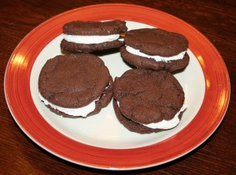

---
# http://learn.getgrav.org/content/headers
title: 'Recipes: Homemade Oreos Redux'
slug: recipes-homemade-oreos-redux
# menu: Recipes: Homemade Oreos Redux
date: 29-02-2012
published: true
publish_date: 29-02-2012
# unpublish_date: 29-02-2012
# template: false
# theme: false
visible: true
summary:
    enabled: true
    format: short
    size: 128
taxonomy:
    category: [Food]
    tag: []
author: aaron
metadata:
    author: aaron

---

When I started my [Adventures in Baking](../adventures-in-baking-aib-overview "Adventures in Baking (AiB): Overview"), [Homemade Oreos](../aib-homemade-oreos "AiB: Homemade Oreos") was one of the first things I made. The girls had a bake sale today, so we made more of these cookies last night. We tripled the dough recipe and doubled the filling recipe. I use 1 tablespoon of dough for each cookie and 1 tablespoon of filling. The recipe yielded 8 dozen individual cookies and enough filling to make 3.5 dozen complete oreos (leaving 1 dozen individual cookies leftover). The only issue was that the filling ended up a little on the sweet side. In the future I’d want to reduce the sugar, but then I’d need to find a way to replace the lost volume.

Anyway, the cookies tasted great!

