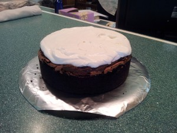
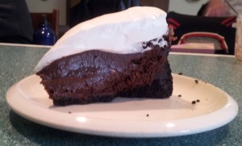

---
# http://learn.getgrav.org/content/headers
title: 'Recipes: Mississippi Mud Pie'
slug: recipes-mississippi-mud-pie
# menu: Recipes: Mississippi Mud Pie
date: 01-07-2012
published: true
publish_date: 01-07-2012
# unpublish_date: 01-07-2012
# template: false
# theme: false
visible: true
summary:
    enabled: true
    format: short
    size: 128
taxonomy:
    category: [Food]
    tag: []
author: aaron
metadata:
    author: aaron

---

Original Recipe: <http://gracessweetlife.com/2012/06/mississippi-mud-pie-best-chocolate-cake-pie/>

Well this is my last baking experiment until we move into the new house. I’ve been packing the pounds back on. Once we’re in the new place, we’re going to move to a weekend-only baking schedule. (Yeah, right. We’ll see.) There are just too many recipes to try!!

This is one of those cakes that are meant for show. If you just want the flavours, it’s easier to make the cake, dole some pudding and whipped cream on top, and then sprinkle it with Oreo crumbs. For wowing at a party, though, where the entire cake will be consumed in one sitting, this is pretty awesome.

I should note that I did not use Frangelico, coffee, or espresso (obviously). I just used a quarter cup plus a few tablespoons of whole milk and a little bit of extra cocoa. Hazelnut extract is impossible to find.

The components are an Oreo crust, with a flourless cake inside, pudding on top, and then finished with whipped cream. It’s best cut and served slightly frozen. Grace’s recipe is perfectly serviceable, but I’m a little picky about my flourless chocolate cake. Most I don’t like. The [Torta Caprese](../recipes-torta-caprese-flour-less-chocolate-cake "Recipes: Torta Caprese (Flour-less chocolate cake)") is by far my fave. This cake rose too high and then never caved in far enough. I had to dig some cake out to make room for the pudding. As for the pudding, it was meant for this type of recipe. It is thicker (twice the corn starch) and more substantial than [my preferred pudding recipe](../aib-good-ol-fashioned-chocolate-pudding "AiB: Good ol’ fashioned Chocolate Pudding"). If I make this again, I will use a 10&Prime; pan, use half to three-quarters of a Torta Caprese batch for the flourless cake, but probably use this pudding recipe just because it is thicker. I’ll be sure to update the pictures the next time I make it.

Yield: 1 × 9&Prime; cake (but I think 10&Prime; is better)

Verdict: Perfect for the right occasion.

P.S. I’m sorry my pictures are crap. I just can’t compete with Grace’s *mise en place*.

The entire assembled cake.

One slice.

