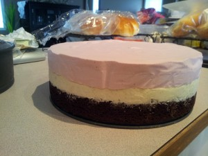
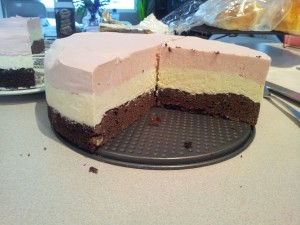
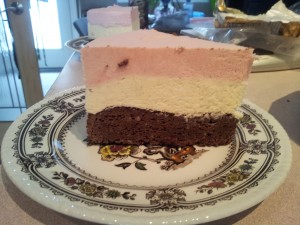

---
# http://learn.getgrav.org/content/headers
title: 'Recipes: Neapolitan Mousse Cake(s)'
slug: recipes-neapolitan-mousse-cakes
# menu: Recipes: Neapolitan Mousse Cake(s)
date: 22-04-2013
published: true
publish_date: 22-04-2013
# unpublish_date: 22-04-2013
# template: false
# theme: false
visible: true
summary:
    enabled: true
    format: short
    size: 128
taxonomy:
    category: [Food]
    tag: []
author: aaron
metadata:
    author: aaron

---

Original recipe: <http://gracessweetlife.com/2013/04/neapolitan-mousse-cakes/>

Tasty! I love strawberries, so the idea of a strawberry mousse was too much not to try. I don’t have 3-inch ring molds, so I decided to make a single large cake. I did some math and thought a 9-inch springform would be enough, but not quite. Next time I’ll use my 10-inch pan; I’m confident it will contain it all. I didn’t bother with the ganache topping this time. We had lots of homemade chocolate sauce set aside for ice cream.

The mousses are delicious. We didn’t love the cake, though. It was good; it just wasn’t quite perfect. I think I’ll have an opportunity to make two for some birthdays. If so, I’ll use a single [torta caprese](../recipes-torta-caprese-flour-less-chocolate-cake "Recipes: Torta Caprese (Flour-less chocolate cake)") recipe divided between the two pans. Or I’ll experiment with some different chocolate cakes.

It’s not difficult to make, and it’s less rich than the similar [chocolate mousse cake](../aib-chocolate-mousse-cake "AiB: Chocolate Mousse Cake") recipe I’ve made before. Give it a try! You won’t regret it.

The cake just out of the spring form

After cutting

Single slice
