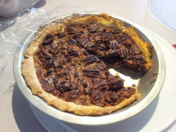

---
# http://learn.getgrav.org/content/headers
title: 'Recipes: Pecan Pie'
slug: recipes-pecan-pie
# menu: Recipes: Pecan Pie
date: 08-09-2013
published: true
publish_date: 08-09-2013
# unpublish_date: 08-09-2013
# template: false
# theme: false
visible: true
summary:
    enabled: true
    format: short
    size: 128
taxonomy:
    category: [Food]
    tag: []
author: aaron
metadata:
    author: aaron

---

Adele *loves* pecan pie. I’ve been looking for a good recipe and have thus far failed. I came across a new book by The Culinary Institute of America called *Baking & Pastry: Mastering the Art and Craft*. It’s another text book similar to the [Gisslen book](../professional-baking-by-wayne-gisslen "“Professional Baking” by Wayne Gisslen") I refer to often. Overall, though, I prefer Gisslen’s book. *Baking & Pastry* has lots of great recipes and good pictures, but the recipes are, for the most part, high yield. Gisslen’s base recipes are still appropriate for home use, but there’s an appendix that gives high-yield versions of all of them for professional bakers. The one fault Adele has with the Gisslen book is that it does *not* have a recipe for pecan pie!! Well *Baking & Pastry* does. Here it is:

### Pie Dough

- All-purpose flour: 1.36 kg
- Salt: 28 g
- Butter, cut into pieces, chilled: 907 g (4 cups; 2 bricks)
- Cold water: 480 mL (2 cups)

1. Combine flour and salt in a large bowl.
2. Add butter and “cut” with a pastry cutter until pea-sized nuggets form.
3. Add the water all at once and mix until the dough just comes together. (You might need an extra few tablespoons, depending on the environment.)
4. Turn out, scale, and wrap tightly.
5. Each unit should be refrigerated for at least an hour before rolling out.

As written, this recipe will make over six pounds of dough! Far too much for normal usage. I cut it in half and got enough for four 10 inch pies. When it comes to cutting butter into flour, what has worked best for me is to freeze the butter and then grate it with a cheese grater. This gets the butter the perfect size and makes sure it stays cold while cutting.

### Pecan Pie Filling

Makes enough for one 9 inch pie.

- Pie dough (see above): 284 g
- Sugar: 14 g
- Bread flour: 14 g
- Dark corn syrup: 298 g
- Eggs, beaten: 99 g (roughly 2 eggs)
- Vanilla extract: 1 tsp
- Salt: 1/2 tsp
- Butter, melted: 28 g
- Pecan halves, toasted: 113 g
- (optional) Chocolate chunks: 170 g

1. Roll out the dough and line the pan.
2. Combine the sugar and flour in a bowl and whisk together.
3. Add the corn syrup and blend thoroughly.
4. Add eggs, vanilla, and salt and mix until incorporated.
5. Stir in the melted butter.
6. Spread the pecans evenly in the pie shell and pour the corn syrup mixture on top.
7. Bake at 450F until the crust begins to brown (about 15 minutes). Reduce the oven temperature to 325F and bake until the filling is set (about 25 minutes longer).
8. Cool completely before serving.

I found the cooking time and temperatures to be too much in my oven. Adjust as necessary. I also only put in half as much chocolate (80 g) and Adele said it was perfect. Adjust to taste.

Final verdict: I’m not a huge pecan pie fan, but Adele said it was better than most. We’ll see what she thinks as she eats more of it. I’m not sure if this pie dough is ideal, but it worked. It should be easy to make these into tarts. Just watch your temperature and baking time.

Enjoy!

Pecan pie

