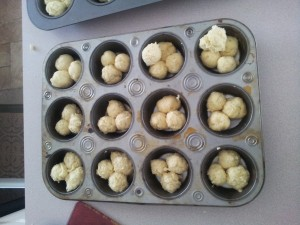

---
# http://learn.getgrav.org/content/headers
title: 'Recipes: Pizza, brioche, and angel food'
slug: recipes-pizza-brioche-and-angel-food
# menu: Recipes: Pizza, brioche, and angel food
date: 17-11-2012
published: true
publish_date: 17-11-2012
# unpublish_date: 17-11-2012
# template: false
# theme: false
visible: true
summary:
    enabled: true
    format: short
    size: 128
taxonomy:
    category: [Food]
    tag: []
author: aaron
metadata:
    author: aaron

---

We had some family staying with us this last week and we had a larger family dinner to boot, so I had three baking opportunities. Here’s the breakdown.

## Pizza

I love pizza—specifically, real honest-to-goodness Italian *pizza napoletana*. I even bought a baking stone for my oven just so I could at least try to re-create such deliciousness at home. It takes a little work, and a standard home kitchen generally does not have the tools to make the process as easy as possible, but when it’s all said and done, it’s *so* worth it—even if the results are not (yet) quite what I’m aiming for. I’m afraid you have to do without pictures again. No sooner does it come out of the oven it is cut and gobbled down.

The recipe I use comes from [the free e-book from Forno Bravo on home pizza-making](http://www.fornobravo.com/pizza/index.html). They of course recommend using real Italian Tipo 00 flour. We have a number of Italian markets in the area, so this is the only flour I’ve used so far, but my next batch I’ll make with regular flour and we’ll see how it goes. The basic recipe is simple:

- Flour: 500 g (100%)
- Water: 325 g (65%)
- Salt: 10 g (2%)
- Yeast, active dry: 3 g (0.6%)

I use 6–7 grams of fresh yeast instead. The water you use to hydrate/activate your yeast should come out of the water already measured. If you simply add more water, then you need to add more flour.

So far this recipe has worked well. The e-book goes through how to form the pizza balls and all of that as well. This recipe makes three 10–12&Prime; pizzas. For me the hardest part is forming the pizza itself and transferring it onto the stone. This last time (my third attempt) was the easiest yet, so practice will make perfect. I haven’t achieved the perfect thickness and texture yet—and maybe in a conventional oven (even with a baking stone) I never will—but they still taste wonderful! Homemade is always best.

These next two recipes come from my favourite book, [Wayne Gisslen’s *Professional Baking*, 5th edition](../professional-baking-by-wayne-gisslen "“Professional Baking” by Wayne Gisslen").

## Brioche

We had a family dinner and I said I would bring the rolls. My very first attempt at brioche was an unmitigated failure. I got zero rise and ended up with a really dense egg-bread. This time I increased the yeast a little to compensate for the higher elevation, and it worked! Because I had never made rolls with this recipe before, I doubled it. It turns out the base recipe makes just over a dozen cloverleaf-style rolls.

### Sponge

- Milk: 60 g (20%)
- Yeast, fresh: 15 g (5%) [I used 20 g.]
- Bread flour: 60 g (20%)

### Dough

- Eggs: 150 g (50%)
- Bread flour: 240 g (80%)
- Sugar: 15 g (5%)
- Salt: 6 g (2%)
- Butter, softened: 210 g (70%)

Heat the milk and soften/activate your yeast in it. Mix in with the flour and let rise in a warm place until it doubles in volume.

In a mixer with a paddle attachment, gradually mix the sponge with the eggs and then the remaining dry ingredients until you form a soft dough.

Beat in the butter a little at a time until it is completely absorbed and the dough is smooth. It will be very sticky!

If you’re making a simple loaf, let ferment for 20 minutes before panning and baking. If you’re going to make rolls, the dough is easier if handled while chilled. Put the dough in the fridge overnight.

Make the rolls or loaf up and let proof. (The book doesn’t say how long, but usually it’s about an hour, or until doubled in volume.) Egg wash after proofing. Rolls should bake at 400F (200C) and larger units should bake at 375F (190C).

The book goes into all sorts of different ways to make rolls. I went with the cloverleaf rolls, where you make little balls of dough and put three or four in a muffin tin. As they rise and bake, you get these great pull-apart rolls.

Cloverleaf-style brioche rolls in the pan, before baking

After baking you get:

Cloverleaf-style brioche rolls, after baking

## Angel Food Cake

I’ve been making gallons of ice cream lately, so my freezer was overflowing with baggies of egg whites, so I decided to try the book’s angel food cake recipe. [I’ve posted about homemade angel food before](../recipes-angel-food-cake "Recipes: Angel Food Cake"), but the recipe from Gisslen’s book is my new favourite. The whole system of “baker’s percentages” really shines with this type of recipe where it’s almost impossible to precisely measure a particular ingredient—in this case, egg whites.

The base recipe in the book makes two cakes, and almost no home kitchen will have a bowl big enough to prepare the entire base recipe in a single bowl. The whites of a dozen or so large eggs are usually enough for a single cake. From there, just do the math! (It really is easy! Take the weight of your egg whites, multiply by 100, then divide by 267. That will give you the weight that equals 100%.) And according to the book, you can turn it into a chocolate angel food cake by substituting roughly 25% of the flour for cocoa powder (90 g, for this base recipe).

- Egg whites: 1000 g (267%)
- Cream of tartar: 8 g (2%)
- Salt: 5 g (1.5%)
- Sugar: 500 g (133%)
- Vanilla extract: 10 g (2.5%)
- Almond extract: 5 g (1.25%)

- Sugar: 500 g (133%)
- Cake flour: 375 g (100%)

Put the egg whites, cream of tartar and salt in a bowl and start whipping. After a few seconds, add the extracts. As the whites start to thicken, gradually add the first portion of sugar a little bit at a time. Whip to soft peaks. Do not overwhip! If you do, the cake will not hold together as well.

Sift together the flour and remaining sugar and sprinkle some over the whipped egg whites. Gently fold the flour/sugar mixture into the whites. Repeat until all the flour and sugar has been incorporated.

Spoon the mixture into an *ungreased* angel food pan. For a normal sized pan (10&Prime;), bake at 350F (175C) for 40–50 minutes. It’s done when it’s nice and brown on top and the cake bounces back when you touch it.

Invert the pan on a funnel or something similar and let the cake cool completely. Once cooled, run a knife around the outside and centre to release the cake.

This particular recipe produces a marvelous moist cake. Hands down my favourite angel food cake ever. Still no pictures—I know; I’m a slacker—but I’ll be sure to take one and report when we make a chocolate one next week sometime.

