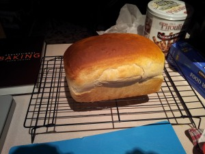

---
# http://learn.getgrav.org/content/headers
title: 'Recipes: Plain White Bread'
slug: recipes-plain-white-bread
# menu: Recipes: Plain White Bread
date: 29-12-2012
published: true
publish_date: 29-12-2012
# unpublish_date: 29-12-2012
# template: false
# theme: false
visible: true
summary:
    enabled: true
    format: short
    size: 128
taxonomy:
    category: [Food]
    tag: []
author: aaron
metadata:
    author: aaron

---

Well I’ve made a half-dozen different types of bread lately but I’ve yet to make just a plain white loaf of bread. That changed yesterday. I tried [Gisslen’s](../professional-baking-by-wayne-gisslen "“Professional Baking” by Wayne Gisslen") white pan bread recipe. I was hoping for two loaves, but apparently the only pans I have are 9×5, which appears to be relatively large. So I only got one (albeit large) loaf. The result was absolutely delicious. It had a great texture, was nice and soft, and very tasty. We had to have a hot slice with butter and honey, but the rest we cut up and turned into French toast for dinner—with real maple syrup, of course. Num! Here’s the recipe:

- Water: 300 g (60%)
- Yeast, fresh: 18 g (3.75%) [I use 10–20% more because of our elevation.]
- Bread flour: 500 g (100%)
- Salt: 12 g (2.5%)
- Sugar: 18 g (3.75%)
- Nonfat milk solids [powdered skim milk, I think]: 25 g (5%)
- Shortening: 18 g (3.75%)

Basically, just throw everything in your mixer and mix for 10 minutes at the second speed. I take the water and divide it into two bowls. One bowl I heat up and add the yeast and sugar. In the other bowl I dissolve the salt. After the dough is mixed, let ferment for about an hour and a half. Put in a greased loaf pan, proof, then bake at 400F until done. Gisslen recommends baking it with steam for the first 10 minutes, but I have a baking stone, so that’s not an option. One of these days I’ll remember to remove the stone before turning the oven on and I’ll try it with steam. Enjoy!

Loaf of plain white bread
