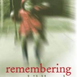

---
# http://learn.getgrav.org/content/headers
title: '"Remembering Our Childhood" by Karl Sabbagh'
slug: remembering-our-childhood-by-karl-sabbagh
# menu: "Remembering Our Childhood" by Karl Sabbagh
date: 01-06-2011
published: true
publish_date: 01-06-2011
# unpublish_date: 01-06-2011
# template: false
# theme: false
visible: true
summary:
    enabled: true
    format: short
    size: 128
taxonomy:
    category: ["Books>Nonfiction"]
    tag: [3star,Karl Sabbagh,memory,psychology]
author: aaron
metadata:
    author: aaron
#      description: Your page description goes here
#      keywords: HTML, CSS, XML, JavaScript
#      robots: noindex, nofollow
#      og:
#          title: The Rock
#          type: video.movie
#          url: http://www.imdb.com/title/tt0117500/
#          image: http://ia.media-imdb.com/images/rock.jpg
#  cache_enable: false
#  last_modified: true

---

**Rating:** 3/5

Karl Sabbagh, *Remembering Our Childhood: How Memory Betrays Us* (Oxford University Press, 2011).

This book turned out to be not quite what I expected. I thought it would be a lower-level discussion of what memory is, but instead this book is a higher-level overview of memory (childhood memory in particular) and focuses primarily on false or repressed memories that come up often in child abuse cases. Sabbagh examines the literature and makes the case that memory is so fallible (it is a reconstructive process, not a reproductive one), and children in particular are so suggestible, that it is irresponsible to use such memories in the sending of innocent people to jail (as happened frequently in the ’80s and ’90s). It does contain some very interesting information on how memory works (and doesn’t work), but it is largely a review of research and case studies orchestrated to make a very specific point (which I think he does very well). If the concept of repressed memories is interesting to you, then you will certainly want to read this book. It’s relatively short but includes good footnotes and lots of resources for further reading.

