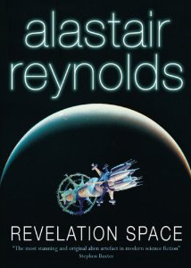

---
# http://learn.getgrav.org/content/headers
title: '"Revelation Space" trilogy by Alastair Reynolds'
slug: revelation-space-trilogy-by-alastair-reynolds
# menu: "Revelation Space" trilogy by Alastair Reynolds
date: 31-03-2010
published: true
publish_date: 31-03-2010
# unpublish_date: 31-03-2010
# template: false
# theme: false
visible: true
summary:
    enabled: true
    format: short
    size: 128
taxonomy:
    category: ["Books>Fiction"]
    tag: [4star,Alastair Reynolds,scifi,series]
author: aaron
metadata:
    author: aaron

---

**Rating:** 4/5

Alastair Reynolds, *Revelation Space* (Ace/Berkeley Pub., 2000).

———, *Redemption Ark* (Gollancz, c.2002).

———, *Absolution Gap* (Gollancz, 2003).

I recently finished the *Revelation Space* trilogy by Alistair Reynolds. The other books are *Redemption Ark* and *Absolution Gap*. I have to say, I really enjoyed the books. They did not, however, reach the level of “classic” for me. “Classic” to me means a book I will read multiple times, every year or so. (As far as speculative fiction goes, that’s Tolkien, Herbert, and Asimov.) I’m starting to wonder, though, if the reason those authors have stuck with me is because of my age when I first read them. I guess with more and more books under your belt, it becomes harder and harder to be really impressed or surprised.

Overall, the story and characters are solid and well written. The issues I have are not so fundamental. One of the issues I had was with the chronology. He insists on using absolute dates, but not often enough (particularly in the first book) for the reader to keep up. I found myself constantly flipping to previous chapter headings to get my bearings as he goes from past to future to far past to distant future and back again.

I found myself particularly irritated by numerous editorial errors. The 2nd book is particularly awful. The first had a few too many typographical errors (usually the omission of an article) and the third book was pretty clean. The 2nd, however, was rife with fundamental errors: confusion between to and too, spelling errors, and the worst was a confusion between etymology and entomology.

My biggest problem with the 2nd book was the incessant cursing. It was almost enough for me to put the book down. The first is pretty clean, and the third is worse but still within my personal threshold, but the 2nd (particularly the character of Antoinette Bax) was just…grrr.

In large stories like this, it is not uncommon for there to be a few loose ends. (Tolkien’s Tom Bombadil immediately comes to mind.) When the book was over, however, I had way too many questions that were never answered, some pretty big ones too IMO.

All that said, I would still recommend the book to most people. The story is well paced and the characters are quite engaging. I thought the development of the Scorpio character in the 3rd book was particularly believable and well-handled. (There’s a reason the 3rd book won a bunch of awards and the others didn’t.)

I’d be interested in hearing other people’s opinions if you ever get around to reading them.

