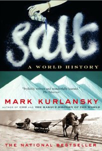

---
# http://learn.getgrav.org/content/headers
title: '"Salt" by Mark Kurlansky'
slug: salt-by-mark-kurlansky
# menu: "Salt" by Mark Kurlansky
date: 06-11-2010
published: true
publish_date: 06-11-2010
# unpublish_date: 06-11-2010
# template: false
# theme: false
visible: true
summary:
    enabled: true
    format: short
    size: 128
taxonomy:
    category: ["Books>Nonfiction"]
    tag: [3star,economics,history,Mark Kurlansky,politics]
author: aaron
metadata:
    author: aaron

---

**Rating:** 3/5

Mark Kurlansky, *Salt: A World History* (A. Knopf Canada, 2002).

If you like reading history, then you’ll enjoy the book. It’s well organized and clearly written—very accessible writing style. If history bores you, then the book will bore you. It is just what it says it is, a book on the history of salt production throughout the world. Some very interesting stuff, actually! I did do a bit of skimming, though, when I got to parts that weren’t particularly interesting to me personally.
