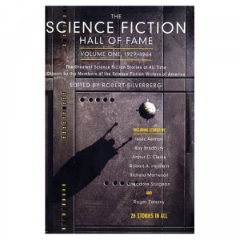

---
# http://learn.getgrav.org/content/headers
title: '"Science Fiction Hall of Fame, Vol. 1" edited by Robert Silverberg'
slug: science-fiction-hall-of-fame-vol-1-edited-by-robert-silverberg
# menu: "Science Fiction Hall of Fame, Vol. 1" edited by Robert Silverberg
date: 11-09-2012
published: true
publish_date: 11-09-2012
# unpublish_date: 11-09-2012
# template: false
# theme: false
visible: true
summary:
    enabled: true
    format: short
    size: 128
taxonomy:
    category: ["Books>Fiction"]
    tag: [3star,Robert Silverberg,scifi,short stories]
author: aaron
metadata:
    author: aaron

---

**Rating:** 3/5

Robert Silverberg (ed.),  *Science Fiction Hall of Fame: Volume One, 1929–1964* (New York: Tom Doherty Associates, 1970).

I typically really enjoy historic science fiction, and I was really looking forward to reading this collection. I wasn’t totally disappointed. About half the stories were really enjoyable, and a few were truly exceptional. “Microcosmic God” was great and “Nightfall” is a classic. I really enjoyed “The Weapon Shop” and “Huddling Place” was chilling. “Arena” was great but reminded me of something you’d expect in an original-series Star Trek episode. “First Contact” was thought provoking, “Scanners Live in Vain” was bizarre, and “The Little Black Bag” was an interesting comeuppance story. “Surface Tension” was an interesting exploration of a different point of view. “It’s a *Good* Life” had to be the source of a Twilight Zone episode I remember watching back in the day. “Flowers for Algernon” was a truly pathetic (in the original sense of the word) piece, and I think my favourite was “The Cold Equations.” I found it profoundly spiritual.

If you like older science fiction, pick this one up.
