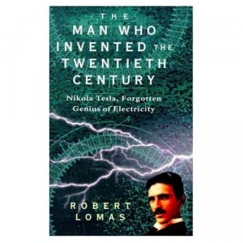

---
# http://learn.getgrav.org/content/headers
title: '"The Man Who Invented the Twentieth Century" by Robert Lomas'
slug: the-man-who-invented-the-twentieth-century-by-robert-lomas
# menu: "The Man Who Invented the Twentieth Century" by Robert Lomas
date: 27-05-2012
published: true
publish_date: 27-05-2012
# unpublish_date: 27-05-2012
# template: false
# theme: false
visible: true
summary:
    enabled: true
    format: short
    size: 128
taxonomy:
    category: ["Books>Nonfiction"]
    tag: [4star,biography,Nikola Tesla,Robert Lomas,science]
author: aaron
metadata:
    author: aaron

---

**Rating:** 4/5

Robert Lomas, *The Man Who Invented the Twentieth Century: Nikola Tesla, Forgotten Genius of Electricity* (London: Headline, 1999).

This is an excellent non-academic biography (no source notes) of Nikola Tesla. I knew *of* Tesla, but it was nice to read his story from beginning to end. Lomas is obviously sympathetic towards Tesla, but I don’t care what you say, there is no way to spin Tesla’s story in such a way as to redeem Edison, Westinghouse, and JP Morgan. Edison especially was, in the immortal words of Matthew Inman, [a douchebag](http://theoatmeal.com/comics/tesla). This is a short and easy read that I recommend to anyone.
