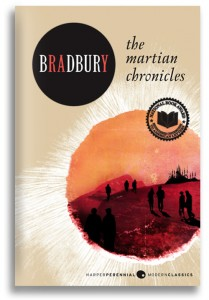

---
# http://learn.getgrav.org/content/headers
title: '"The Martian Chronicles" by Ray Bradbury'
slug: the-martian-chronicles-by-ray-bradbury
# menu: "The Martian Chronicles" by Ray Bradbury
date: 03-01-2012
published: true
publish_date: 03-01-2012
# unpublish_date: 03-01-2012
# template: false
# theme: false
visible: true
summary:
    enabled: true
    format: short
    size: 128
taxonomy:
    category: ["Books>Fiction"]
    tag: [5star,Ray Bradbury,scifi]
author: aaron
metadata:
    author: aaron

---

**Rating:** 5/5

 Ray Bradbury, *The Martian Chronicles* (New York: Avon, 2011).

Originally published in 1950, *The Martian Chronicles* is another of those classics that I have known about but never taken the time to read. This  is a true piece of literary art—poetry. The core story is of the colonization of Mars. It doesn’t sound very poetic, but trust me. Even if you’re not a science fiction fan, you will find something in these stories that moves you. The book is written as a series of vignettes in chronological order, starting with the original martians, the arrival of the first humans, the colonization process, all the way to the ending that I will not spoil. I loved everything about this book. I loved the variety, the humanity, the different ways he plays with the “other.” I highly recommend this book to anybody who enjoys good literature, whether or not you like science fiction.
