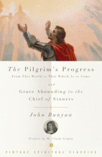

---
# http://learn.getgrav.org/content/headers
title: '"The Pilgrim&#8217;s Progress" by John Bunyan'
slug: the-pilgrims-progress-by-john-bunyan
# menu: "The Pilgrim&#8217;s Progress" by John Bunyan
date: 04-04-2011
published: true
publish_date: 04-04-2011
# unpublish_date: 04-04-2011
# template: false
# theme: false
visible: true
summary:
    enabled: true
    format: short
    size: 128
taxonomy:
    category: ["Books>Fiction"]
    tag: [John Bunyan,religion,unrated]
author: aaron
metadata:
    author: aaron

---

John Bunyan, *The Pilgrim’s Progress: From This World to That Which Is to Come*, ed. John F. Thornton and Susan B. Varenne (New York: Vintage Books, 2004).

This is another of those books you encounter tangentially in any study of the arts or humanities but rarely actually sit down and read. This is another book I have chosen not to rate. It’s art and stands on its own merits.

[Bunyan (1628–1688) was a Puritan and was imprisoned for over six years for preaching](http://en.wikipedia.org/wiki/John_Bunyan "John Bunyan article on Wikipedia"). [*Pilgrim’s Progress*](http://en.wikipedia.org/wiki/Pilgrim%27s_Progress "Wikipedia article for 'Pilgrim's Progress' itself") was written while in jail and is an allegorical story of man’s journey to Heaven. It’s written in two parts. The first is the story of Christian (the name he takes upon himself when he decides to begin his journey)— how he comes to a realization of his fallen state, leaves his family to seek redemption (because they won’t come with him despite his desperate pleas), and his encounters as he travels to the Celestial City. The second part is the account of Christian’s wife and children who eventually realize that they too wish to be saved and take their own pilgrimage. This particular edition also includes Bunyan’s autobiography of sorts entitled *Grace Abounding in the Chief of Sinners*. (I did not read this section carefully, but skimmed through it.)

I personally enjoyed very much the first part. The second part was quite repetitive and became tedious for me. [I am a devout Christian myself](http://mormon.org), but I can’t say my theological outlook aligns that closely with the Puritan one (or at least what I understand of it). Still, there were numerous parts of the story that I found very engaging and that stimulated further thought and reflection. This is a classic work of English literature that really should be engaged at some level by everyone, religious or not. Even if you just read the first part, you will have encountered the bulk of what he has to say.
