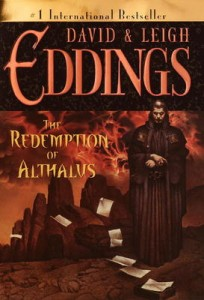

---
# http://learn.getgrav.org/content/headers
title: '"The Redemption of Althalus" by David &#038; Leigh Eddings'
slug: the-redemption-of-althalus-by-david-leigh-eddings
# menu: "The Redemption of Althalus" by David &#038; Leigh Eddings
date: 19-10-2010
published: true
publish_date: 19-10-2010
# unpublish_date: 19-10-2010
# template: false
# theme: false
visible: true
summary:
    enabled: true
    format: short
    size: 128
taxonomy:
    category: ["Books>Fiction"]
    tag: [1star,Eddings,fantasy,young adult]
author: aaron
metadata:
    author: aaron

---

**Rating:** 1/5

David & Leigh Eddings, *The Redemption of Althalus* (Del Rey, 2001).

In short, don’t bother. I finally put the book down about a third of the way through. I found it on a list of fantasy must-reads. Well it sure doesn’t make mine.

It’s not that it is written for a young adult audience, it’s just that’s *all* it was written for. There are so many excellent examples of young adult fiction that is artfully written with engaging and deep stories that engage young and old alike: J. K. Rowling, Tolkien, Ursula LeGuin, Patricia McKillip, to name a few. *Redemption* has flat characters (don’t let the intriguing introduction fool you), puerile dialogue, and juvenile, stereotyped relationships. There was really nothing there for anyone over 15.

I was looking forward to the book, too. The only other Eddings books I’ve read were the *Belgariad* series some 20 years ago, which I loved at the time. Maybe if I read them again now I’d feel the same way. Who knows.
