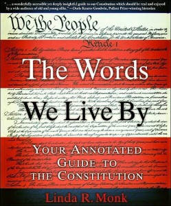

---
# http://learn.getgrav.org/content/headers
title: '"The Words We Live By" by Linda Monk'
slug: the-words-we-live-by-by-linda-monk
# menu: "The Words We Live By" by Linda Monk
date: 11-02-2012
published: true
publish_date: 11-02-2012
# unpublish_date: 11-02-2012
# template: false
# theme: false
visible: true
summary:
    enabled: true
    format: short
    size: 128
taxonomy:
    category: ["Books>Nonfiction"]
    tag: [4star,history,Linda Monk,politics]
author: aaron
metadata:
    author: aaron

---

**Rating:** 4/5

 Linda R. Monk, *The Words We Live By* (New York: Hyperion, 2003).

This book is the entire text of the US Constitution and its 27 amendments, annotated line by line with explanations, historical motivations, and ramifications thereof. If you’re a US citizen, or just interested in politics, then understanding the Constitution is essential. This book gives you not just the text but also the tools to understand this incredible document. No law degree required. Now to find a similar book for the Canadian Constitution!
