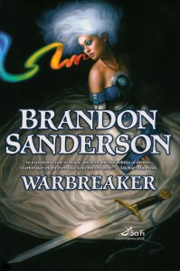

---
# http://learn.getgrav.org/content/headers
title: '"Warbreaker" by Brandon Sanderson'
slug: warbreaker-by-brandon-sanderson
# menu: "Warbreaker" by Brandon Sanderson
date: 25-06-2013
published: true
publish_date: 25-06-2013
# unpublish_date: 25-06-2013
# template: false
# theme: false
visible: true
summary:
    enabled: true
    format: short
    size: 128
taxonomy:
    category: ["Books>Fiction"]
    tag: [4.5star,Brian Sanderson,fantasy]
author: aaron
metadata:
    author: aaron

---

**Rating:** 4.5/5

Brian Sanderson, *Warbreaker* (New York: Tor, 2009), 592 p.

This book reminded me of why I love (and, yes, in some ways hate) single-volume novels. They’re great in that they completely sidestep the “soap opera” problem so prevalent with massive series such as *Wheel of Time* and *Game of Thrones*. The author is forced to get to the point, tell a compelling story, and then get out. The longer the series goes, the more ridiculous they tend to become. Trilogies are usually OK, but these unbounded series really come across to me as nothing more than soap operas.

The problem with single-volume works, though, is that the author often never answers certain questions, and that can be frustrating at times. Usually, though, the good outweighs the bad.

I struggled with rating this book. Looking at the theoretical underpinnings of the story (i.e., world history, magic system, messages conveyed), I would rate it a 4 out of 5. Everything is really good, but not quite 5-star material. But, based on pure narrative flow, I have no choice but to give it a 5. I just found I couldn’t put the book down! I found myself annoyed when my bus approached my stop because I had to close the book. While baking, I put the book on the counter next to me so I could keep reading. I found the overall story, with all its unexpected twists and turns, to be quite compelling—the characters are sufficiently fleshed out to be believable, back story and technical details are addressed at the moment they’re needed and no sooner, and the pacing is bang on.

Though it seems to me that the book is really targeted to young adults (the moral messaging is very appropriate for adolescents), Sanderson still writes a story interesting to adults as well. There is some sexuality, but it is muted, with no explicit language or graphic descriptions.

My only beef is with how Sanderson ends the book. The climax and denouement are very satisfying, but ultimately the book ends far too abruptly. There are a number of key questions that I would have liked to see answered, and there are even a few narrative loose ends. Ultimately, it’s not a sin in a single-volume work to leave some things for the reader to simply infer, but I do like things to be tied up in a nice little bow by the end. One of the loose ends in this book, for example, is a mechanical question that appears to completely contradict the magic system painstakingly laid out. By not resolving that thread, it feels like a bit of a cop out to me.

Anyway, this was a compelling and exciting read that I heartily recommend to fantasy lovers everywhere. I will definitely be looking up more of Sanderson’s work.

