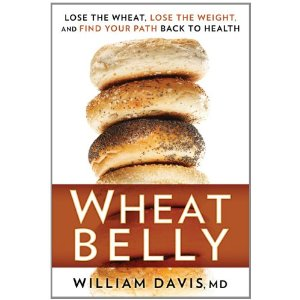

---
# http://learn.getgrav.org/content/headers
title: '"Wheat Belly" by William Davis'
slug: wheat-belly-by-william-davis
# menu: "Wheat Belly" by William Davis
date: 14-11-2011
published: true
publish_date: 14-11-2011
# unpublish_date: 14-11-2011
# template: false
# theme: false
visible: true
summary:
    enabled: true
    format: short
    size: 128
taxonomy:
    category: ["Books>Nonfiction"]
    tag: [5star,diet,nutrition,William Davis]
author: aaron
metadata:
    author: aaron

---

**Rating:** 5/5

 William Davis, *Wheat Belly: Lose the Wheat, Lose the Weight, and Find Your Path Back to Health* (New York: Rodale, 2011).

This is another book that talks about the low-carb diet, wheat in particular. Did you know that wheat impacts your blood sugar even more than table sugar? One of his main points is that the wheat we eat today is simply not the same wheat we were eating even 50 years ago.

Davis’s writing style is a little too informal for my taste, but the information is still sound. I’m a convert, and if you care about your health, I really recommend that you [at least read some of these books](http://perlkonig.com/tag/diet/).

