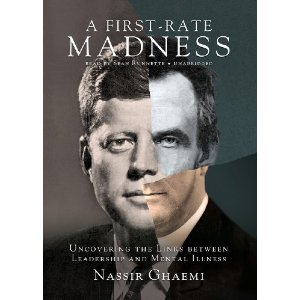

**Rating:** 3/5

Nassir Ghaemi, *A First-Rate Madness* (New York: Penguin, 2011).

The thesis of the book is that in times of peace and plenty, the best leader is a mentally normative (or “homoclite”) one. In crisis, however, you need an exceptional leader. Ghaemi asserts that the best such leaders are mentally abnormal. He focuses mainly on depression and mania, selecting four major traits of manic-depressives (creativity, realism, empathy, and resilience) and examines the careers of leaders such as Ghandi, Martin Luther King, FDR, JFK, and others.

## The Good

One thing the book does well is confront the reader’s preconceptions of what mental health really means. You can’t read the book and not feel strongly about his initial postulates and definitions. Ghaemi does a good job of laying out the framework of his study, and he is at least forthcoming about its limitations. Ghaemi’s theory is at the very least provocative, and I did enjoy the read.

## The Not So Good

The book reeks of selection bias. While he starts with numerous disclaimers and explanations of the limits of the study, he retains a tone of definitiveness and authority that is simply untenable. He focuses exclusively on depression and mania (in particular the combination of the two: bi-polar disorder)—a very narrow selection. At the end of the book, as he discusses the stereotypical homoclite (or mentally normative) leader, he talks about hubris syndrome but doesn’t classify it as an illness.He selects his case studies very carefully (nothing wrong with that) but even though I’m no expert in American history, there were numerous assertions in the book that set off my BS buzzers. And the four major traits he focuses on (creativity, realism, empathy, and resilience) are hardly traits found only in the mentally ill. Ultimately his scope is too narrow and evidence too subjective for this book to be any more than an interesting and anecdotal look at persons of historical interest through the eyes of a psychiatrist.

## Conclusion

I agree with Ghaemi that the stigmas surrounding mental illness need to be done away with. I think he raises some important points (intentionally and unintentionally) about mental illness, its diagnosis, and treatment, that deserve to be discussed. If any of these topics interest you, then the few hours it takes to read the book will not be wasted.
