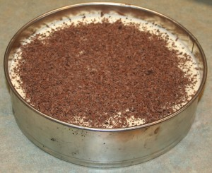
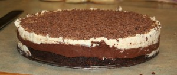
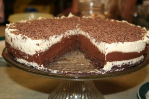
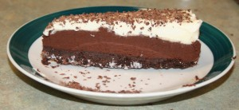

[Part of the Adventures in Baking (AiB) series.](../adventures-in-baking-aib-overview "Adventures in Baking (AiB): Overview")

Original recipe: <http://www.sugarduchess.com/2011/04/chocolate-mousse-cake/>

Oh&mdash;my&mdash;goodness. This was divine! It is super, super rich. A tiny slice is all you need. Because I know nobody would believe that I made this, I’m attaching pictures. I only had a 10-inch pan, so it’s not as tall, but for a first attempt, I think it looks pretty good. It tastes terrific!

Actual yield: N/A

Verdict: Delicious! Keeper!

UPDATE (18 MAY 2012): I’ve made the cake a few times over the intervening months, but my most recent foray included some 70% dark chocolate (4 oz) in both of the bottom two layers. The final verdict was that it was a touch too bitter. It looks like straight semi-sweet is best (60% at the most). Also, make sure you have enough white chocolate. I undermeasured a little and the result was an insufficient contrast between the flavours.

Still in the pan

Springform pan removed

Interior shot

Cake slice
