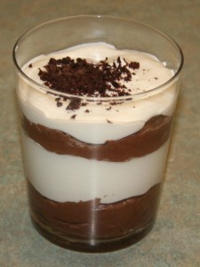
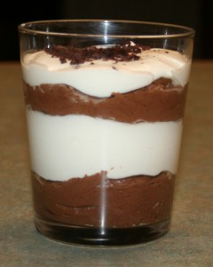

[Part of the Adventures in Baking (AiB) series.](../adventures-in-baking-aib-overview "Adventures in Baking (AiB): Overview")

[This is the second time I have made the chocolate mousse.](../aib-chocolate-mousse/ "AiB: Chocolate Mousse") This time I did it as a layered parfait, and I used bittersweet chocolate. The bittersweet chocolate makes all the difference. Semi-sweet chocolate is just that little bit too sweet. Num!

