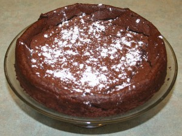

[Part of the Adventures in Baking (AiB) series.](../adventures-in-baking-aib-overview "Adventures in Baking (AiB): Overview")

Original recipe: <http://www.foodnetwork.ca/recipes/craggy-chocolate-cake/recipe.html?dishid=10332>

I kinda liked it! It’s a different texture, but a really nice flavour. It’s crisp on the outside but light—almost like a souflé—on the inside. I think the texture would be even better if I had the 8&Prime; pan. You’ll notice in the picture that the outside is quite a bit higher than the middle. This is because I only had a 9.5&Prime; pan. If you’re gluten intolerant, this is an excellent recipe. Dust the pan with cocoa powder instead of flour.

Actual yield: N/A

Verdict: Keeper, for the right occasion.

Craggy Flourless Cake
