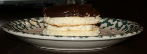

[Part of the Adventures in Baking (AiB) series.](../adventures-in-baking-aib-overview "Adventures in Baking (AiB): Overview")

Original recipe: <http://gracessweetlife.com/2011/03/mini-boston-cream-pies/>

Well the sponge cake tastes good, though I baked it a little thin. The pastry cream recipe didn’t work at all, though that’s at least partly my fault. I overcooked it. In my own defense, the recipe does say to boil the milk, but that’s at least partly why my cream turned to jelly. [I instead found a different pastry cream recipe](http://video.about.com/culinaryarts/Pastry-Cream-Recipe.htm) and used that. That recipe worked out pretty good. The dark chocolate ganache is delish. The pies are quite tasty. If I were to do it again, I would just do a single big cake. I’ll eventually try injecting the cream into donuts, too.

Actual yield: 6 mini pies. This recipe yields three times more ganache than you actually need and the cream recipe I used made twice as much cream as I needed.

Verdict: Pretty good. At least I know how to make pastry cream now!

