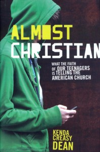

**Rating:** 5/5

 Kenda Creasy Dean, *Almost Christian: What the Faith of Our Teenagers is Telling the American Church* (Oxford University Press, 2010).

I’ve been holding off writing this review so I could let the book percolate a bit in my head. Regardless of where you might stand theologically, the debate/struggle/discussion this book represents is, in my opinion, vital. I happen to believe strongly in the reality of God, Jesus Christ, and all that that entails. So not surprisingly, a book that encourages a deeper engagement with religion is one I welcome. I have a few pages of notes, but I’m not going to hash it all out here. If you read the book and want to chat about it, drop me a line.

The author is a Methodist minister, and she wrote this book in response to the [National Study of Youth and Religion](http://www.youthandreligion.org/). What the study essentially found is that teens are largely apathetic towards religion (surprise), and that as far as parents are concerned, you get what you are—meaning that, statistically speaking, kids will approach religion the same way their parents do (again, no real surprise there). What Dean decries the most is what she calls “moralistic therapeutic deism” (MTD), which she asserts is supplanting Christianity entirely, and largely because “we” (the churches and their ministers) are letting it. Moralistic therapeutic deism describes the idea of God as butler and/or lifeguard. He is there if you want something, he’s there if you get into real trouble, but otherwise he doesn’t really care about your life or demand anything of you. It includes the idea that all God really wants is for us to feel good about ourselves; again, he makes no demands of us. In one of my favourite quotes, Dean offers an explanation as to why youth don’t engage with God and religion by saying that “they are unlikely to take hold of a God too limp to take hold of them” (p. 36). Dean asserts (and I agree) that the God of the Bible is not weak, detached, or uninvolved. He makes very real demands of us, and in return makes great promises.

Dean attacks MTD over and over again from many different angles. She is brutally introspective and lays a great deal of blame for the success of this philosophy on the churches themselves. She explores how this happened and makes suggestions as to how religious leaders can change. She digs down into some of the data and explores some of the reasons certain religious are more successful than others at engaging their youth. [The Church of Jesus Christ of Latter-day Saints](http://lds.org) is a major focus of the study, their youth consistently scoring highest or second highest in every measure of religious engagement. She even dedicates an entire chapter just to the Church. [As a Mormon myself](http://mormon.org/me/4C1X/), I found her analysis fascinating. She does make a couple of outright errors when discussing Church doctrine, but on the whole she is on key.

Whether or not you are religious yourself, I think you would find the book (and the other literature that surrounds it) highly thought provoking. Dean is obviously very passionate, and her writing is strong and clear. I think this is an important discussion to keep alive.
